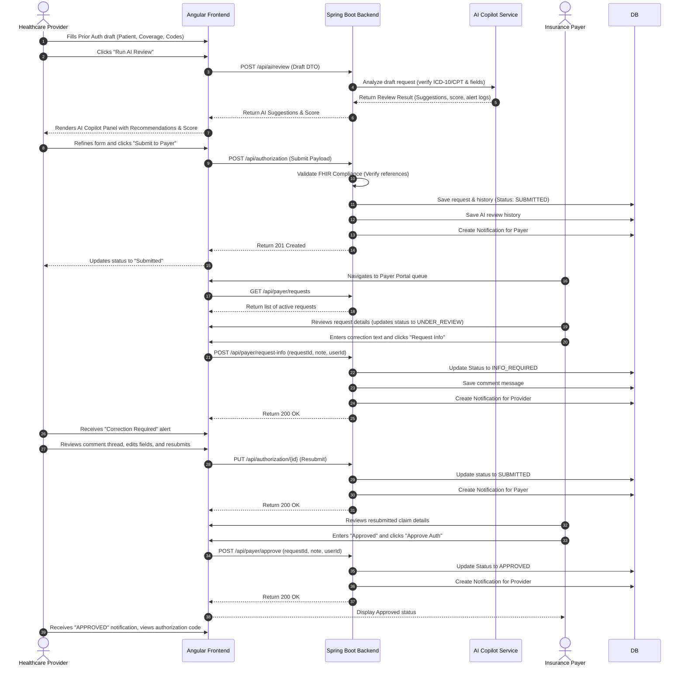

# Smart Healthcare Connector Platform - Technical Architecture

This document describes the design patterns, systems layout, database ER model, and FHIR schemas backing the Smart Healthcare Connector Platform.

---

## 1. High-Level Architecture Design

The platform uses a layered enterprise architecture:
1. **Presentation Layer (Angular)**: Rich standalone components serving portals for Providers (claiming & drafting) and Payers (reviewing & decisioning). Uses reactive state management with Angular Signals.
2. **Business & Integration Layer (Spring Boot)**: Exposes REST APIs, enforces validation rules, maps FHIR resources, and orchestrates the AI Copilot.
3. **Data Access Layer (Spring Data JPA)**: Maps entities to database tables with audit triggers.
4. **AI Copilot Service**: Performs static code evaluation and matches rules against ICD-10 chapters.
5. **Persistence Layer (PostgreSQL)**: Stores user permissions, request histories, chat details, and notifications.

```
       +---------------------------------------------+
       |             Presentation (Angular)          |
       |  [Provider Portal]      [Payer Portal]      |
       +----------------------|----------------------+
                              | REST APIs
                              v
       +---------------------------------------------+
       |            Spring Boot API Services         |
       |  [Security] [Auth] [Claim] [FHIR] [AI] [Not]|
       +----------------------|----------------------+
                              | JPA Queries
                              v
       +---------------------------------------------+
       |             PostgreSQL Database             |
       |   (Users, Requests, Histories, Messages)    |
       +---------------------------------------------+
```

---

## 2. Sequence Diagram (Workflow)



---

## 3. FHIR Compliance Design

Prior Authorization Requests are modeled on the HL7 FHIR R4 `Claim` resource with `use = "preauthorization"`.

### FHIR Claim Schema Structure

* **`resourceType`**: Must be `"Claim"`.
* **`use`**: Must be `"preauthorization"`.
* **`patient`**: Reference pointing to the FHIR Patient resource, e.g. `{"reference": "Patient/pat-101"}`.
* **`insurance`**: List containing coverage reference links, e.g. `[{"sequence": 1, "focal": true, "coverage": {"reference": "Coverage/cov-201"}}]`.
* **`diagnosis`**: Diagnostic codes (ICD-10-CM system) backing the clinical request, e.g.:
  ```json
  "diagnosis": [
    {
      "sequence": 1,
      "diagnosisCodeableConcept": {
        "coding": [
          {
            "system": "http://hl7.org/fhir/sid/icd-10",
            "code": "M17.11",
            "display": "Unilateral primary osteoarthritis, right knee"
          }
        ]
      }
    }
  ]
  ```
* **`item`**: Procedure / treatment codes (CPT/HCPCS systems) defining the requested service, e.g.:
  ```json
  "item": [
    {
      "sequence": 1,
      "productOrService": {
        "coding": [
          {
            "system": "http://www.ama-assn.org/go/cpt",
            "code": "27447",
            "display": "Arthroplasty, knee"
          }
        ]
      }
    }
  ]
  ```

---

## 4. PostgreSQL Database Schema ER Model

The schema uses audit columns (`created_at`, `updated_at`) and foreign keys to enforce relationship integrity:

* `users` **1** -- **0..*** `authorization_requests` (Provider/Payer link)
* `patients` **1** -- **0..*** `coverages`
* `patients` **1** -- **0..*** `authorization_requests`
* `coverages` **1** -- **0..*** `authorization_requests`
* `authorization_requests` **1** -- **0..*** `status_history` (Audit timeline)
* `authorization_requests` **1** -- **0..*** `messages` (Chat logs)
* `authorization_requests` **1** -- **1** `ai_reviews` (Persisted AI Copilot run)
* `users` **1** -- **0..*** `notifications`
