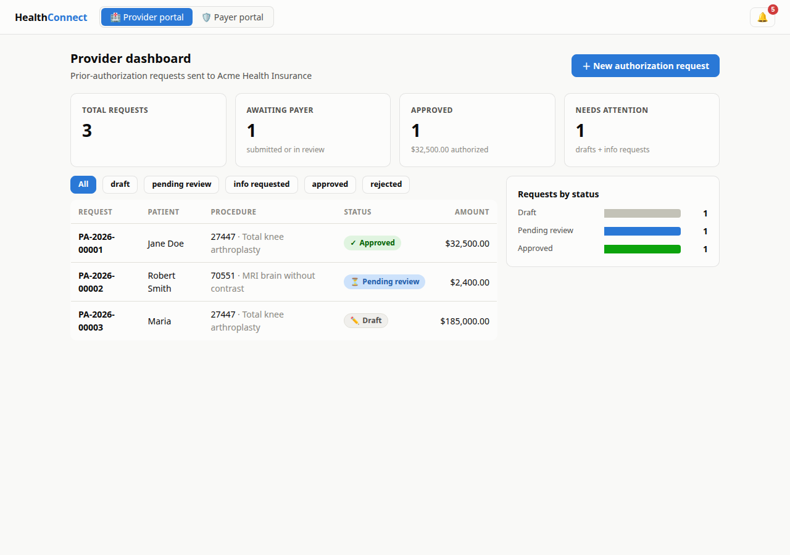
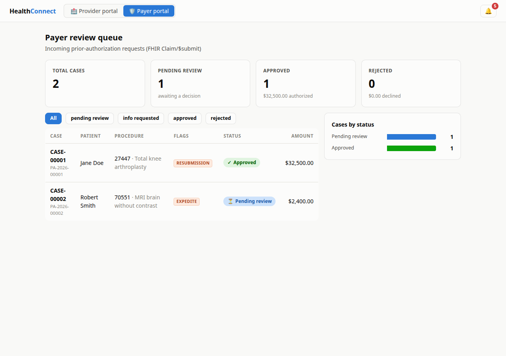

# HealthConnect

A smart healthcare connector platform for **prior authorization** — bidirectional communication
between healthcare providers (hospitals, clinics) and payers (insurance companies), built on
**FHIR R4** standards with an **AI copilot** that validates requests and recommends corrections
before submission.



## Features

- **Provider portal** — create and manage prior-authorization requests with patient, insurance,
  clinical and financial details; dashboard with live status tracking.
- **AI copilot** — reviews every request before it reaches the payer: required-field checks,
  NPI checksum validation, ICD-10/CPT format checks, diagnosis–procedure consistency, and
  plain-language correction suggestions with a readiness score. Requests with unresolved errors
  are blocked from submission. Optionally augmented by a Claude (Anthropic API) advisor for
  clinical-consistency review — the platform runs fully without it.
- **FHIR-based exchange** — requests travel as FHIR R4 `Claim` bundles
  (`use = preauthorization`, Da Vinci PAS pattern) to the payer's `Claim/$submit` endpoint;
  decisions return as `ClaimResponse` resources. Implemented with HAPI FHIR.
- **Payer portal** — review queue with automatic triage flags (expedite, high amount,
  resubmission), approve / reject / request-more-information actions, and a raw-FHIR viewer.
- **Bidirectional loop** — when a payer requests more information, the provider amends and
  resubmits; the same case re-enters the review queue with full history preserved.
- **Status tracking & notifications** — a validated state machine journals every transition to a
  timeline, and both portals have notification inboxes for submissions, decisions and info
  requests.

## Architecture

Two independent Spring Boot services — separate databases, communicating only over FHIR — plus a
shared FHIR library and a React frontend serving both portals.

```
        React frontend (:5173)
        │                    │
        ▼                    ▼
provider-service ──── FHIR Claim ────►  payer-service
     (:8081)                               (:8082)
requests · AI copilot                review queue · decisions
        ▲                                     │
        └──────── FHIR ClaimResponse ◄────────┘
```

Requests move through a simple lifecycle:
`Draft → Submitted → Pending review → Approved / Rejected / Info requested` (with amend &
resubmit when more information is requested).

| Component | Stack |
|---|---|
| `provider-service` (:8081) | Java 17, Spring Boot 3, Spring Data JPA, H2, Anthropic Java SDK |
| `payer-service` (:8082) | Java 17, Spring Boot 3, Spring Data JPA, H2 |
| `common-fhir` | HAPI FHIR (R4) mapping, shared workflow state machine |
| `frontend` (:5173) | React 18, Vite, React Router |

## Getting started

Prerequisites: Java 17+, Maven 3.9+, Node 20+ — or just Docker.

**With Docker:**

```bash
docker compose up --build
```

**Or run directly:**

```bash
mvn clean package                                            # build + run all tests

java -jar payer-service/target/payer-service-1.0.0.jar       # terminal 1
java -jar provider-service/target/provider-service-1.0.0.jar # terminal 2

cd frontend && npm install && npm run dev                    # terminal 3
```

Open **http://localhost:5173**. On first start the provider service seeds demo data: two clean
requests are auto-submitted to the payer, and one deliberately flawed draft is left for trying
out the copilot.

To enable the Claude-powered copilot advisor (optional):

```bash
export ANTHROPIC_API_KEY=sk-ant-...   # before starting the provider service
```

API documentation (Swagger UI): [provider](http://localhost:8081/swagger-ui.html) ·
[payer](http://localhost:8082/swagger-ui.html)

## Try the flow

1. In the **provider portal**, open draft `PA-…-00003` and click *Run AI copilot* — it flags the
   missing last name, an NPI that fails its checksum, a diagnosis that doesn't support the
   procedure, and more. Submission stays blocked until the errors are fixed.
2. Fix the fields and submit — the payer acknowledges with a case number.
3. Switch to the **payer portal**: the case is in the queue with triage flags. Choose
   *Request info* with a note.
4. Back in the provider portal, a notification arrives and the request is editable again —
   amend it and resubmit.
5. The payer sees the resubmission flagged; *Approve* it, and the provider gets the approval
   notification with the complete timeline.



## Tests

```bash
mvn test
```

Covers FHIR round-trip mapping fidelity, the workflow state machine, each copilot validation
rule, and the payer intake → decision → resubmission workflow over the real wire format.

## Project structure

```
├── common-fhir/          # Shared library: FHIR R4 mapper, state machine, transport DTOs
├── provider-service/     # Provider API: requests, AI copilot, FHIR submission, notifications
├── payer-service/        # Payer API: FHIR intake, review queue, decisions, callbacks
├── frontend/             # React app: provider + payer portals
├── docker/               # Dockerfiles and nginx config
└── docker-compose.yml
```

## Configuration

| Environment variable | Default | Purpose |
|---|---|---|
| `PAYER_BASE_URL` | `http://localhost:8082` | Provider → payer FHIR endpoint |
| `PROVIDER_BASE_URL` | `http://localhost:8081` | Payer → provider decision callbacks |
| `ANTHROPIC_API_KEY` | *(unset)* | Enables the Claude copilot advisor |
| `DEMO_SEED` | `true` | Seed demo requests on an empty database |
| `CORS_ALLOWED_ORIGINS` | `http://localhost:5173,…` | Allowed browser origins |
