## Smart Healthcare Connector Platform

## Overview
Healthcare Connector is a smart healthcare communication platform designed to facilitate seamless interaction between healthcare providers and payers during the authorization approval process.
The platform enables providers to submit authorization requests, allows payers to review and approve or reject requests, and provides status tracking and notifications throughout the workflow.
An AI Copilot module is integrated to review requests and provide recommendations before submission, helping reduce incomplete requests and improving communication efficiency.
---------------------------------------------------------------------------------------------------------------------------------------------------------------------------------------------------------------
## Problem Statement
Healthcare providers and payers often rely on manual communication for authorization workflows, leading to:
- Incomplete authorization requests
- Delays in approvals
- Increased back-and-forth communication
- Lack of real-time status visibility
This project aims to simplify and automate the authorization lifecycle through a centralized platform.
--------------------------------------------------------------------------------------------------------------
## Features Implemented
### Authentication and Authorization
- JWT-based authentication
- Secure login functionality
- Role-based access control
- Separate dashboards for Providers and Payers
- Passwords are encrypted using BCrypt hashing before storing in the database
- Stateless session management with JWT tokens

### Provider Module
Providers can:
- Create authorization requests
- Enter patient information
- Enter diagnosis details
- Add treatment details
- Specify estimated cost
- Select payer
- Submit requests for review
- Track request status

### AI Copilot Module
The AI Copilot reviews authorization requests before submission and provides:
- Validation checks
- Missing information identification
- Improvement recommendations
- Confidence score for submission readiness

### AI Copilot Integration
- Integrated Google Gemini API to provide AI-powered validation of authorization requests.
- The application sends authorization request details such as patient information, diagnosis, treatment, and estimated cost to the Gemini API using a structured prompt.
- Gemini AI analyzes the request and returns recommendations, potential issues, missing information, and a confidence score before submission.
- This helps providers improve request quality and reduce rejection rates.
- For security reasons, the Gemini API key has been excluded from the repository and should be configured locally before running the application.

### Payer Module
Payers can:
- View submitted authorization requests
- Review request details
- Approve requests
- Reject requests
- Update request status

### Status Tracking
The system supports real-time request status management:
- Pending
- Approved
- Rejected

### Notification System
The platform includes notification capabilities to:
- Alert payers about pending requests
- Notify users regarding request actions
- Display pending requests awaiting review

### FHIR Standard Integration

The application supports healthcare interoperability by generating responses in FHIR (Fast Healthcare Interoperability Resources) Claim format.
FHIR Resources Implemented
The authorization requests are converted into FHIR Claim resources containing:
* Patient Resource
    * Patient information is represented using the FHIR Patient reference.
* Provider Resource
    * Healthcare provider details are represented using the FHIR Provider reference.
* Payer Resource
    * Insurance company information is represented using the FHIR Insurer reference.
* Diagnosis Resource
    * Diagnosis information is mapped using diagnosisCodeableConcept.
* Treatment Resource
    * Treatment information is represented using productOrService.
* Estimated Cost Resource
    * Estimated treatment cost is represented using the FHIR Money data type under the total field with currency support.
* Claim Status
    * Authorization status is mapped to FHIR Claim statuses such as:
        * draft
        * active
        * cancelled
------------------------------------------------------------------------------------------------------------
### API Documentation
- Swagger/OpenAPI integration
- Interactive API testing interface
- API endpoint documentation
------------------------------------------------------------------------------------------------------------
### API Testing
- Postman collection included for all APIs
- End-to-end API testing completed
------------------------------------------------------------------------------------------------------------
## Technology Stack
### Frontend
- Angular
- TypeScript
- HTML
- SCSS
- RxJS
### Backend
- Java
- Spring Boot
- Spring Security
- JWT Authentication
- REST APIs
### Database
- PostgreSQL
### Documentation and Testing
- Swagger OpenAPI
- Postman
### Version Control
- Git
- GitHub
### AI Integration
- Google Gemini API
-------------------------------------------------------------------------------------------------------------
## System Workflow
### Provider Workflow
1. Provider logs into the application.
2. Provider creates an authorization request.
3. AI Copilot validates the request.
4. Provider submits the request.
5. Request status becomes `PENDING`.

### Payer Workflow
1. Payer logs into the application.
2. Payer reviews pending requests.
3. Payer approves or rejects the request.
4. Status is updated accordingly.
5. Notifications are generated for the action.
-------------------------------------------------------------------------------------------------------------------------------------------------
## API Endpoints
### Authentication
- Login API
- 
### Provider APIs
- Create Authorization Request
- View My Requests

### Payer APIs
- View All Requests
- Approve Request
- Reject Request

### AI Copilot APIs
- Validate Request
- Generate Recommendations
----------------------------------------------------------------------------------------------------------------------------------------
## Swagger url 
url : http://localhost:8080/swagger-ui/index.html
-----------------------------------------------------------------------------------------------------------------------------------
## Postman Collection
postman collection for testing the APIs is included in the project repository. You can import the collection into Postman to test the endpoints.
[Health connector.postman_collection.json](../../AppData/Local/Postman/app-12.18.4/Health%20connector.postman_collection.json)
------------------------------------------------------------------------------------------------------------------------------------
## Screenshots

### Login Page
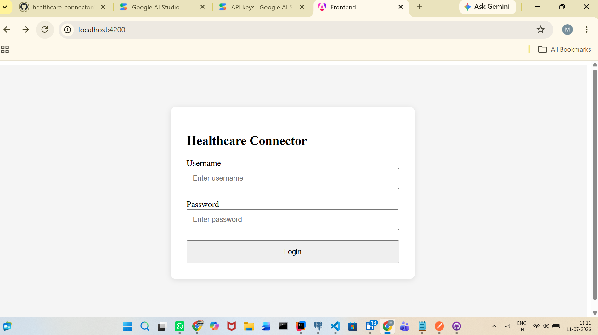

### Provider Dashboard
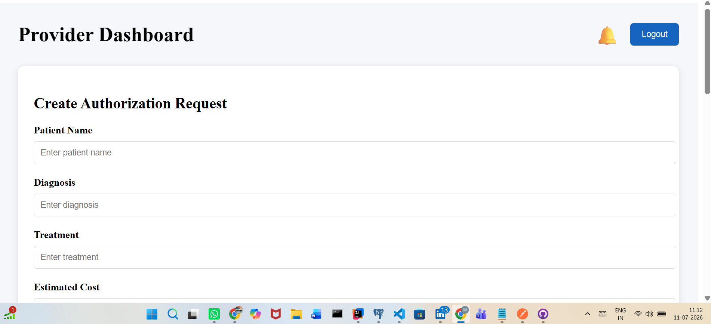
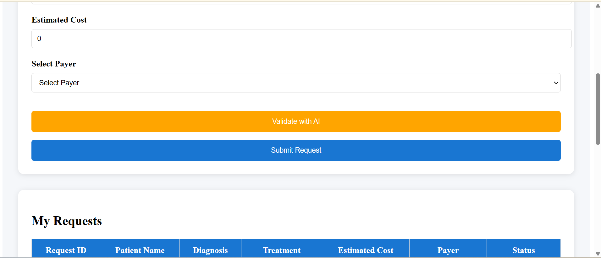
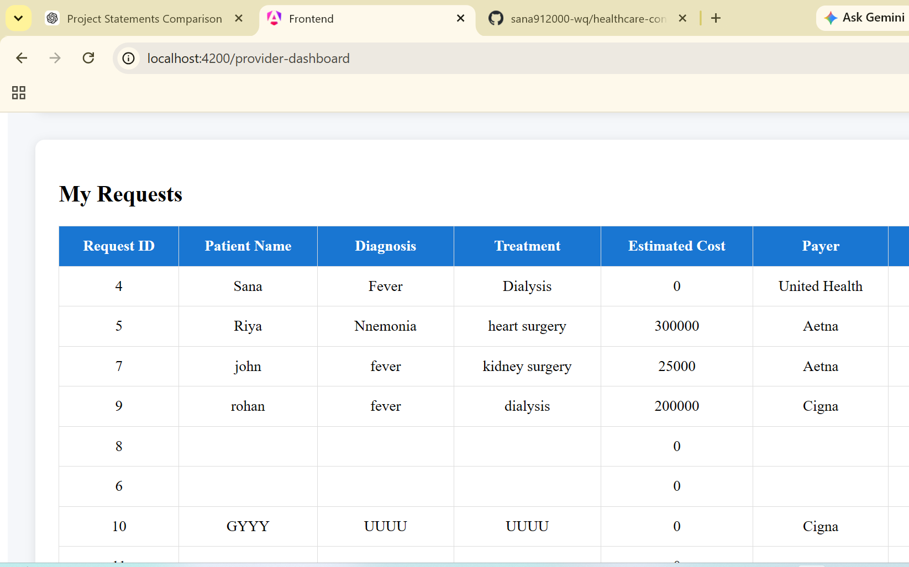

### Payer Dashboard
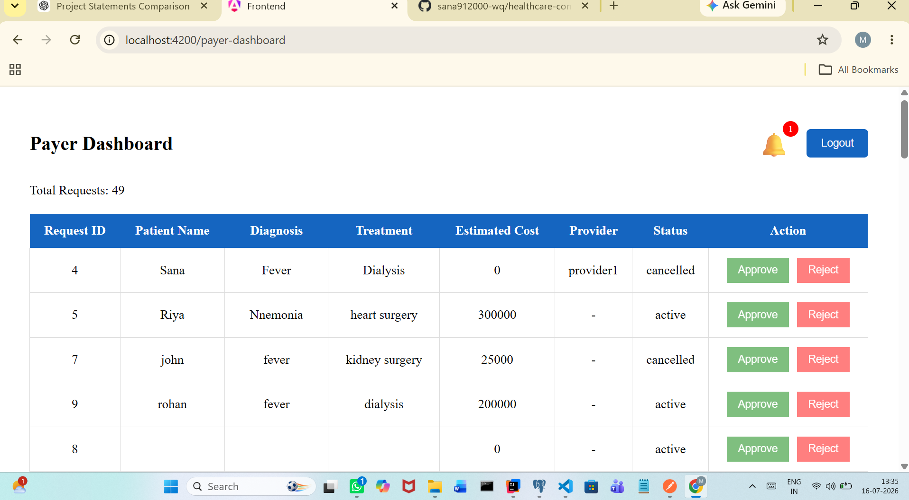

### AI Copilot Validation
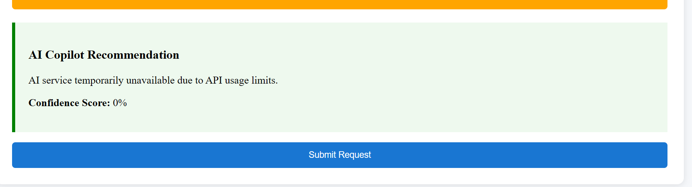

### Notifications
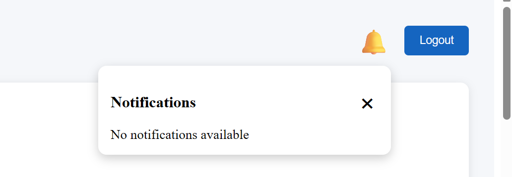
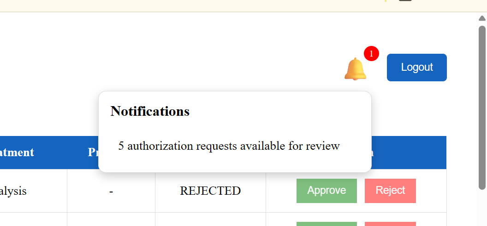

### Swagger API Documentation
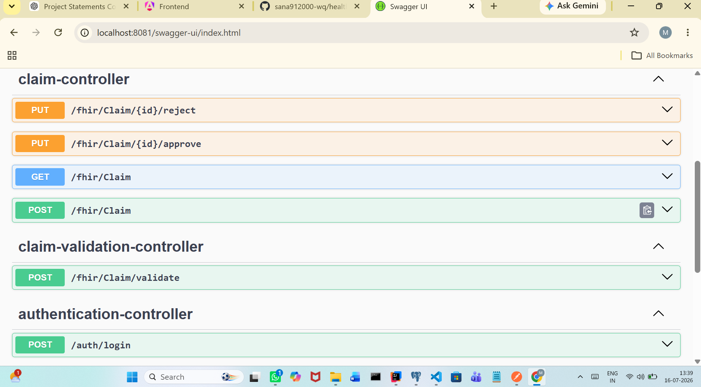

### Database Schema
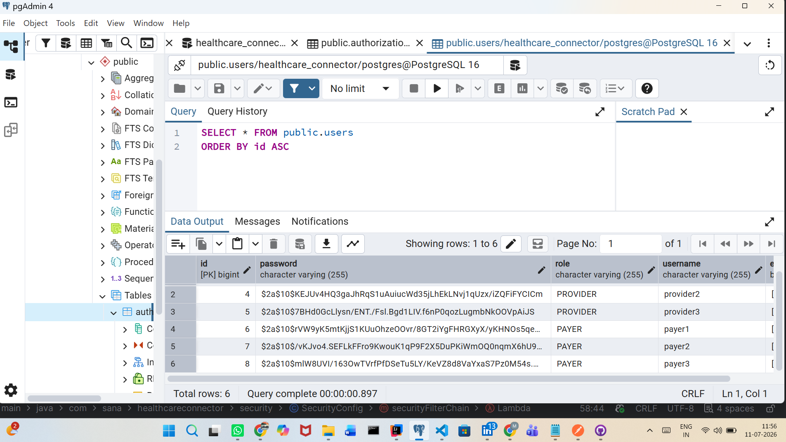
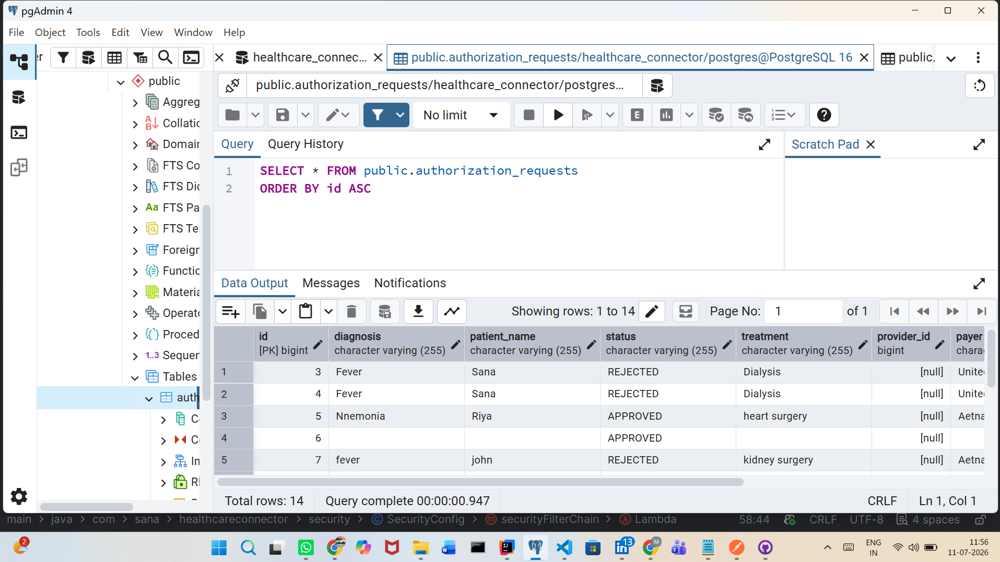
-------------------------------------------------------------------------------------------------------
## Future Enhancements
Given additional development time, the following enhancements can be implemented:
* Email notifications
* Real-time notifications using WebSockets
* File and document upload support
* Audit logging and activity history
* Dashboard analytics and reporting
* AI-powered approval prediction
* Multi-level approval workflows
* Role management for administrators
* Cloud deployment using Docker and Kubernetes
* Integration with external healthcare system
----------------------------------------------------------------------------------------------------------------------------------------
## Development Note
This implementation was completed within a short assignment timeline and focuses on delivering the core business requirements of the authorization workflow.
The architecture has been designed to support future scalability and additional enterprise-level enhancements as required.
-----------------------------------------------------------------------------------------------------------------------------------------------------
## Conclusion
Healthcare Connector demonstrates an end-to-end full-stack implementation of a healthcare authorization workflow using modern technologies including Angular, Spring Boot, JWT authentication, PostgreSQL, Swagger, and AI-assisted validation.
The solution improves provider-payer communication, reduces manual effort, and increases visibility into authorization request processing.
----------------------------------------------------------------------------------------------------------------------------------------------------------------------------------------------------------------------------------------------------------------
