# Smart Healthcare Connector

<div align="center">


**An AI-powered healthcare prior authorization platform enabling seamless bidirectional communication between providers and payers using HL7 FHIR R4 and the Da Vinci PAS Implementation Guide.**

[Features](#features) • [Architecture](#architecture) • [Quick Start](#quick-start) • [API Docs](#rest-api-reference) • [Demo](#demo-credentials)

</div>

---

## 📋 Table of Contents

- [Overview](#overview)
- [Features](#features)
- [Technology Stack](#technology-stack)
- [Architecture](#architecture)
- [Authorization Workflow](#authorization-workflow)
- [AI Copilot Workflow](#ai-copilot-workflow)
- [FHIR Integration](#fhir-integration)
- [Package Structure](#package-structure)
- [Database Design](#database-design)
- [Security](#security)
- [REST API Reference](#rest-api-reference)
- [Quick Start](#quick-start)
- [Demo Credentials](#demo-credentials)
- [Developer Tools](#developer-tools)
- [Screenshots](#screenshots)
- [Future Enhancements](#future-enhancements)
- [Author](#author)
- [License](#license)

---

## Overview

The **Smart Healthcare Connector** modernizes the prior authorization (PA) workflow — one of healthcare's most friction-heavy processes. By combining a Java Spring Boot backend, a modular Vanilla JS frontend, an open-source AI Copilot powered by Meta's Llama 3.1 8B (via Groq), and the HL7 FHIR R4 standard, it creates a single intelligent platform where providers submit PA requests, AI reviews them for completeness and clinical appropriateness, and payers approve, deny, or request more information — all in real time.

> Built as a demonstration of enterprise Java full-stack development with healthcare interoperability standards, suitable for production extension.

---

## Features

| Feature                          | Description                                                                                          |
| -------------------------------- | ---------------------------------------------------------------------------------------------------- |
| 🔐 **JWT Authentication**        | Stateless token-based auth with role separation (Provider / Payer)                                   |
| 🩺 **Provider Portal**           | Create, review, and submit prior authorization requests                                              |
| 🏦 **Payer Portal**              | Review incoming requests, approve, deny, or request more info                                        |
| 🤖 **AI Copilot Review**         | Llama 3.1 8B (open-source) reviews requests for completeness, code accuracy, and approval likelihood |
| 🔗 **FHIR R4 Bundle Generation** | Every request generates a standards-compliant FHIR Bundle (Da Vinci PAS IG)                          |
| 📊 **Status Tracking**           | Full lifecycle tracking: Draft → AI Reviewed → Submitted → Approved/Denied                           |
| 🔔 **Real-time Notifications**   | WebSocket (STOMP/SockJS) push notifications for status changes                                       |
| 📜 **Status History Timeline**   | Immutable audit trail of every state transition                                                      |
| 🛡️ **Role-Based Security**       | Spring Security with endpoint-level access control                                                   |
| 📖 **Swagger / OpenAPI**         | Interactive API documentation at `/swagger-ui/index.html`                                            |
| 🗄️ **H2 In-Memory Database**     | Zero-setup development database with web console                                                     |
| 🌱 **Realistic Seed Data**       | 18 authorization requests covering every workflow state, with AP/Telangana demographics              |

---

## Technology Stack

<details>
<summary><strong>Backend</strong></summary>

| Technology        | Version | Purpose                               |
| ----------------- | ------- | ------------------------------------- |
| Java              | 17      | Core language                         |
| Spring Boot       | 3.x     | Application framework                 |
| Spring Security   | 6.x     | Authentication & authorization        |
| Spring Data JPA   | 3.x     | Data access layer                     |
| Hibernate         | 6.x     | ORM                                   |
| H2 Database       | 2.x     | In-memory relational database         |
| HAPI FHIR         | 7.x     | HL7 FHIR R4 resource generation       |
| JJWT              | 0.12.x  | JWT token management                  |
| WebSocket / STOMP | —       | Real-time bidirectional communication |
| Lombok            | —       | Boilerplate reduction                 |
| Springdoc OpenAPI | 2.x     | Swagger UI generation                 |
| Maven             | 3.x     | Build and dependency management       |

</details>

<details>
<summary><strong>Frontend</strong></summary>

| Technology             | Purpose                                      |
| ---------------------- | -------------------------------------------- |
| HTML5                  | Semantic markup                              |
| CSS3                   | Custom design system with CSS variables      |
| Vanilla JavaScript ES6 | Modular application logic (no framework)     |
| ES Modules             | `import`/`export` based module system        |
| SockJS + STOMP.js      | WebSocket client for real-time notifications |

</details>

<details>
<summary><strong>AI & Healthcare Standards</strong></summary>

| Standard / Tool     | Purpose                                                            |
| ------------------- | ------------------------------------------------------------------ |
| Llama 3.1 8B (Groq) | AI Copilot — open-source model on Groq LPU hardware (1–3s, free)   |
| Mistral 7B (Ollama) | AI Copilot — local open-source model, offline fallback, no API key |
| HL7 FHIR R4         | Healthcare data interchange standard                               |
| Da Vinci PAS IG     | Prior Authorization Support Implementation Guide                   |
| ICD-10-CM           | Diagnosis coding                                                   |
| CPT                 | Procedure coding                                                   |
| NPI                 | Provider identification                                            |

</details>

---

## Architecture

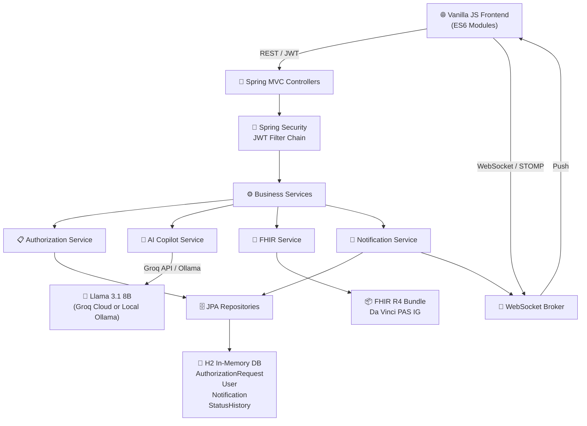

---

## Authorization Workflow

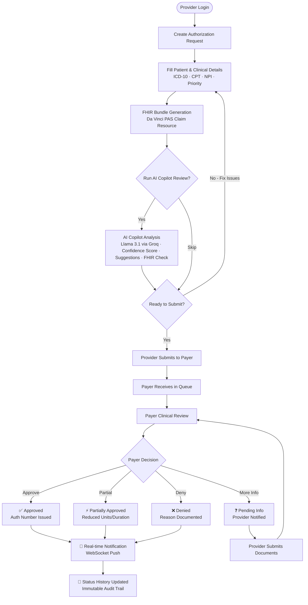

---

## AI Copilot Workflow

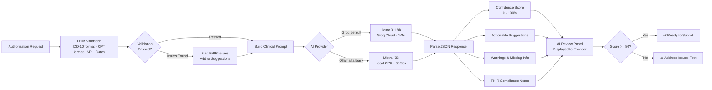

---

## FHIR Integration

Every authorization request is serialized as a **FHIR R4 Bundle** conforming to the [Da Vinci Prior Authorization Support (PAS) Implementation Guide](https://build.fhir.org/ig/HL7/davinci-pas/).

**Bundle Contents:**

| Resource   | Purpose                                      |
| ---------- | -------------------------------------------- |
| `Claim`    | Core PA request (`use = "preauthorization"`) |
| `Patient`  | Patient demographics                         |
| `Coverage` | Insurance member information                 |

<details>
<summary><strong>Example FHIR Claim Resource (abbreviated)</strong></summary>

```json
{
  "resourceType": "Claim",
  "id": "auth-AUTH-20240603-SB003",
  "status": "active",
  "use": "preauthorization",
  "type": {
    "coding": [
      {
        "system": "http://terminology.hl7.org/CodeSystem/claim-type",
        "code": "professional"
      }
    ]
  },
  "patient": {
    "reference": "Patient/P-SEC-003",
    "display": "Narasimha Rao Pelluri"
  },
  "insurer": {
    "reference": "Organization/AROG-TS-001",
    "display": "Aarogyasri Health Care Trust"
  },
  "priority": { "coding": [{ "code": "urgent" }] },
  "diagnosis": [
    {
      "sequence": 1,
      "diagnosisCodeableConcept": {
        "coding": [
          {
            "system": "http://hl7.org/fhir/sid/icd-10-cm",
            "code": "I25.10",
            "display": "Atherosclerotic heart disease, unspecified"
          }
        ]
      }
    }
  ],
  "item": [
    {
      "sequence": 1,
      "productOrService": {
        "coding": [
          {
            "system": "http://www.ama-assn.org/go/cpt",
            "code": "92928",
            "display": "Percutaneous transcatheter placement of intracoronary stent(s)"
          }
        ]
      },
      "quantity": { "value": 1 }
    }
  ]
}
```

</details>

---

## Package Structure

```
com.healthcare.connector
│
├── auth
│   ├── controller        # AuthController — login, register
│   ├── dto               # AuthDTO — LoginRequest, RegisterRequest, AuthResponse
│   ├── entity            # User — implements UserDetails
│   ├── enums             # UserRole (PROVIDER, PAYER)
│   ├── repository        # UserRepository
│   ├── security          # JwtTokenProvider, JwtAuthenticationFilter
│   └── service           # UserService — authentication, session, user queries
│
├── authorization
│   ├── controller        # AuthorizationController — CRUD, AI review, submit, decision, payer/provider listing
│   ├── dto               # AuthorizationDTO — CreateRequest, Response, PayerDecisionRequest, AiReviewResponse
│   ├── entity            # AuthorizationRequest, AuthorizationNote, StatusHistory
│   ├── enums             # AuthorizationStatus, Priority
│   ├── repository        # AuthorizationRequestRepository, StatusHistoryRepository
│   └── service           # AuthorizationService — core workflow orchestration
│
├── notification
│   ├── controller        # NotificationController — list, unread count, mark read
│   ├── dto               # NotificationDTO — NotificationResponse (avoids Hibernate proxy serialization)
│   ├── entity            # Notification
│   ├── repository        # NotificationRepository
│   └── service           # NotificationService — async push + WebSocket dispatch
│
├── ai
│   └── AiCopilotService  # Groq (Llama 3.1) + Ollama (Mistral) — provider switching, prompt building, response parsing
│
├── fhir
│   ├── FhirService       # HAPI FHIR — Claim, Bundle, Patient resource generation
│   └── FhirValidationResult  # Validation issues model
│
└── config
    ├── SecurityConfig    # Spring Security filter chain, CORS, JWT wiring
    ├── WebSocketConfig   # STOMP broker, SockJS endpoint registration
    └── DataSeeder        # CommandLineRunner — seeds 6 providers, 4 payers, 18 auth requests
```

---

## Database Design

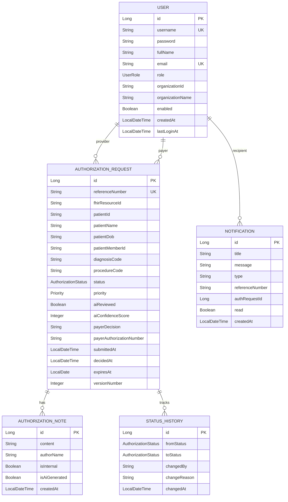

---

## Security

| Concern                 | Implementation                                                                        |
| ----------------------- | ------------------------------------------------------------------------------------- |
| **Authentication**      | JWT Bearer tokens — stateless, no server-side sessions                                |
| **Token Signing**       | HMAC-SHA256 with configurable secret key                                              |
| **Token Expiry**        | 24 hours (configurable via `app.jwt.expiration`)                                      |
| **Password Storage**    | BCrypt hashing via `BCryptPasswordEncoder`                                            |
| **Role Enforcement**    | `@AuthenticationPrincipal` + Spring Security method security                          |
| **Public Endpoints**    | `/api/auth/login`, `/api/auth/register`, `/swagger-ui/**`, `/h2-console/**`, `/ws/**` |
| **Protected Endpoints** | All other `/api/**` routes require valid JWT — including payer/provider listing       |
| **CORS**                | Configurable origins via `app.cors.allowed-origins`                                   |
| **Data Isolation**      | Providers see only their own requests; payers see only requests assigned to them      |

---

## REST API Reference

### Authentication

| Method | Endpoint             | Description                    | Auth Required |
| ------ | -------------------- | ------------------------------ | ------------- |
| `POST` | `/api/auth/register` | Register new provider or payer | ❌            |
| `POST` | `/api/auth/login`    | Login and receive JWT token    | ❌            |

> Payer and provider listing endpoints are protected and moved to the Authorization controller — sensitive organization data should not be publicly accessible without a valid session.

### Authorization Requests

| Method | Endpoint                              | Description                     | Auth Required |
| ------ | ------------------------------------- | ------------------------------- | ------------- |
| `POST` | `/api/authorizations`                 | Create new PA request           | ✅ Provider   |
| `GET`  | `/api/authorizations`                 | List requests for current user  | ✅            |
| `GET`  | `/api/authorizations/{id}`            | Get request by ID               | ✅            |
| `GET`  | `/api/authorizations/payers`          | List all payer organizations    | ✅            |
| `GET`  | `/api/authorizations/providers`       | List all provider organizations | ✅            |
| `POST` | `/api/authorizations/{id}/ai-review`  | Run AI Copilot review           | ✅ Provider   |
| `POST` | `/api/authorizations/{id}/submit`     | Submit request to payer         | ✅ Provider   |
| `POST` | `/api/authorizations/{id}/decision`   | Record payer decision           | ✅ Payer      |
| `GET`  | `/api/authorizations/{id}/history`    | Get status history              | ✅            |
| `GET`  | `/api/authorizations/dashboard/stats` | Dashboard statistics            | ✅            |

### Notifications

| Method | Endpoint                           | Description                 | Auth Required |
| ------ | ---------------------------------- | --------------------------- | ------------- |
| `GET`  | `/api/notifications`               | Paginated notification list | ✅            |
| `GET`  | `/api/notifications/unread`        | Unread notifications        | ✅            |
| `GET`  | `/api/notifications/unread/count`  | Unread count                | ✅            |
| `POST` | `/api/notifications/mark-all-read` | Mark all as read            | ✅            |
| `POST` | `/api/notifications/{id}/read`     | Mark one as read            | ✅            |

---

## Quick Start

### Prerequisites

- Java 17+
- Maven 3.8+
- A local HTTP server for the frontend (Python or Node)
- A free [Groq API key](https://console.groq.com) _(for AI Copilot — recommended, takes 2 minutes)_

### 1. Clone the Repository

```bash
git clone <repository_url>
```

### 2. Configure AI Copilot

The AI Copilot supports two open-source model providers. Both use **open-source models** — the choice is about where the model runs.

---

#### Why Open-Source Models?

This project deliberately uses open-source AI models rather than proprietary APIs (like OpenAI GPT or Anthropic Claude) for the following reasons:

| Reason                    | Detail                                                                                         |
| ------------------------- | ---------------------------------------------------------------------------------------------- |
| **Transparency**          | Model weights are publicly available — no black-box inference                                  |
| **No vendor lock-in**     | Switch between Groq, Ollama, or any other runner without changing the model                    |
| **Cost**                  | Groq free tier: 14,400 req/day at no cost. Ollama: completely free, runs locally               |
| **Healthcare compliance** | Patient data stays within controlled infrastructure — no data sent to proprietary AI providers |
| **Reproducibility**       | Same model version produces consistent results across environments                             |

---

#### Option A — Groq (Recommended)

**Why Groq?** Groq is not an AI model — it is inference infrastructure that runs open-source models on purpose-built LPU (Language Processing Unit) chips. We use Groq to run **Meta's Llama 3.1 8B**, which is a fully open-source model ([HuggingFace](https://huggingface.co/meta-llama/Meta-Llama-3.1-8B)).

|                       | Groq + Llama 3.1 8B    | Local Ollama + Mistral 7B    |
| --------------------- | ---------------------- | ---------------------------- |
| **Response time**     | 1–3 seconds            | 60–90 seconds (CPU)          |
| **Model quality**     | Llama 3.1 > Mistral 7B | Good                         |
| **Cost**              | Free (14,400 req/day)  | Free                         |
| **Internet required** | Yes                    | No                           |
| **API key required**  | Yes (free)             | No                           |
| **Setup time**        | 2 minutes              | 10–15 minutes + 4GB download |

**Setup:**

1. Get a free API key from [console.groq.com](https://console.groq.com) → **API Keys** → **Create Key**
2. Add to `application.properties`:

```properties
ai.copilot.provider=groq
ai.copilot.groq.api-key=gsk_your_key_here
ai.copilot.groq.model=llama-3.1-8b-instant
```

---

#### Option B — Ollama (Local, Offline)

Runs **Mistral 7B** entirely on your machine — no internet, no API key, no data leaves your system.

> **Note:** Ollama is a system-level tool — install it like Java or Maven. Nothing goes into the project folder or Git. The model (~4GB) lives in `~/.ollama/models`.

```bash
# Install Ollama from https://ollama.com
brew install ollama        # Mac
ollama pull mistral        # one-time ~4GB download
brew services start ollama # auto-start on login
```

```properties
ai.copilot.provider=ollama
ai.copilot.ollama.base-url=http://localhost:11434
ai.copilot.ollama.model=mistral
```

The service automatically warms up the model on startup and sends a keep-alive ping every 4 minutes to prevent Ollama's 5-minute idle unload.

---

> **Without any provider configured**, the AI service gracefully falls back to FHIR-only validation with a static confidence score — the application is fully functional in fallback mode.

### 3. Run the Backend

```bash
cd backend
mvn clean install
mvn spring-boot:run
```

Backend starts at: `http://localhost:8080`

On first startup, the `DataSeeder` automatically creates **6 providers**, **4 payers**, and **18 authorization requests** covering every workflow state.

### 4. Run the Frontend

ES modules require a local HTTP server:

```bash
cd frontend

# Python (no install needed)
python3 -m http.server 3000

# OR Node
npx http-server . -p 3000 -c-1
```

Frontend available at: `http://localhost:3000`

---

## Demo Credentials

### Providers

| Username    | Password   | Doctor                   | Hospital                        |
| ----------- | ---------- | ------------------------ | ------------------------------- |
| `provider1` | `password` | Dr. Rama Rao Venkatesh   | NIMS, Hyderabad                 |
| `provider2` | `password` | Dr. Padmavathi Reddy     | Apollo Hospitals, Jubilee Hills |
| `provider3` | `password` | Dr. Srinivas Rao Kunduri | KIMS Hospital, Secunderabad     |
| `provider4` | `password` | Dr. Anuradha Naidu       | CARE Hospitals, Banjara Hills   |
| `provider5` | `password` | Dr. Venkata Reddy Bonam  | GGH, Guntur                     |
| `provider6` | `password` | Dr. Lakshmi Prasanna     | Andhra Hospitals, Vijayawada    |

### Payers

| Username | Password   | Contact                   | Organization                            |
| -------- | ---------- | ------------------------- | --------------------------------------- |
| `payer1` | `password` | Suresh Kumar Yellapragada | Aarogyasri Health Care Trust, Telangana |
| `payer2` | `password` | Vijaya Lakshmi Devi       | NTR Vaidya Seva, Andhra Pradesh         |
| `payer3` | `password` | Rajesh Goud               | Star Health and Allied Insurance        |
| `payer4` | `password` | Meenakshi Sundaram        | United Health Insurance                 |

### Seeded Request Coverage

| Status               | Count | Example Case                                                       |
| -------------------- | ----- | ------------------------------------------------------------------ |
| `DRAFT`              | 2     | Low back pain injection, Rotator cuff repair                       |
| `AI_REVIEWED`        | 1     | CKD hemodialysis — 87% confidence                                  |
| `PENDING_REVIEW`     | 1     | Cataract surgery — awaiting AI                                     |
| `SUBMITTED`          | 2     | Coronary stent, Repeat LSCS                                        |
| `UNDER_REVIEW`       | 1     | Breast cancer mastectomy                                           |
| `APPROVED`           | 4     | Cholecystectomy, TKR, STAT craniotomy, ESRD dialysis               |
| `PARTIALLY_APPROVED` | 1     | Psychotherapy — 12 of 24 sessions                                  |
| `DENIED`             | 2     | Lumbar fusion (criteria not met), Refractive surgery (non-covered) |
| `PENDING_INFO`       | 2     | Coronary angiography, Paediatric tonsillectomy                     |
| `CANCELLED`          | 1     | Wrong patient demographics                                         |
| `EXPIRED`            | 1     | No payer decision within validity period                           |

---

## Developer Tools

### Swagger UI

Interactive API documentation with try-it-out support:

```
http://localhost:8080/swagger-ui/index.html
```

### H2 Database Console

```
URL     : http://localhost:8080/h2-console
JDBC URL: jdbc:h2:mem:smarthealthcaredb
Username: sa
Password: H2sa
```

---

## Screenshots

| Screen               | Preview                                                         |
| -------------------- | --------------------------------------------------------------- |
| Login Page           |                       |
| Provider Dashboard   |  |
| Payer Dashboard      |        |
| Authorization Detail | 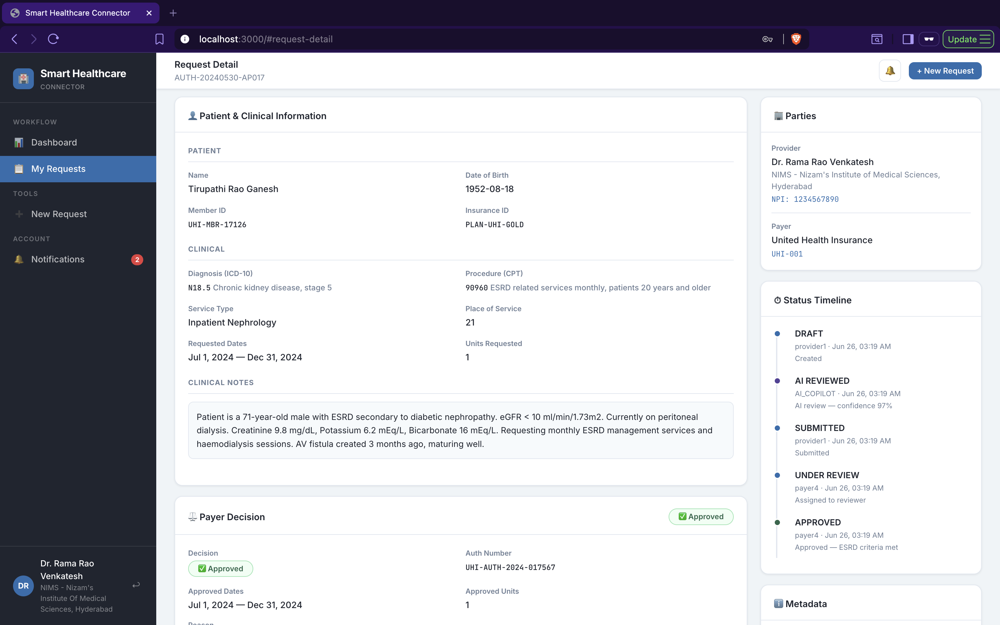            |
| AI Copilot Review    | 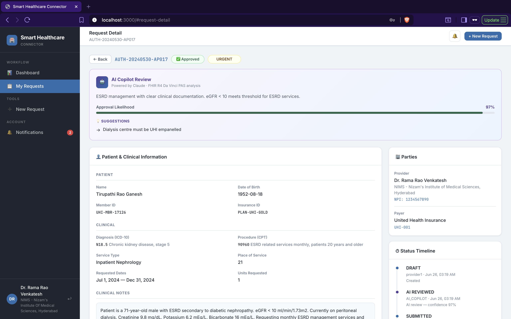            |
| FHIR Bundle Viewer   | 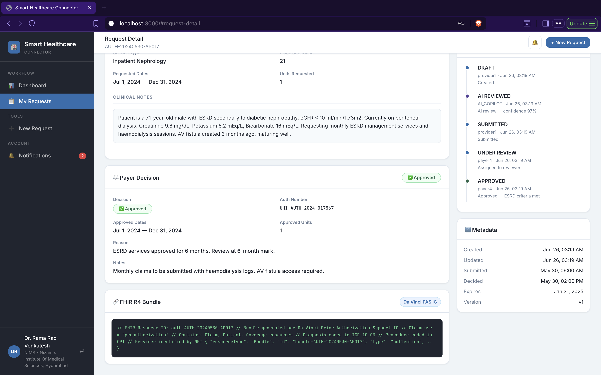                |
| Notifications        | 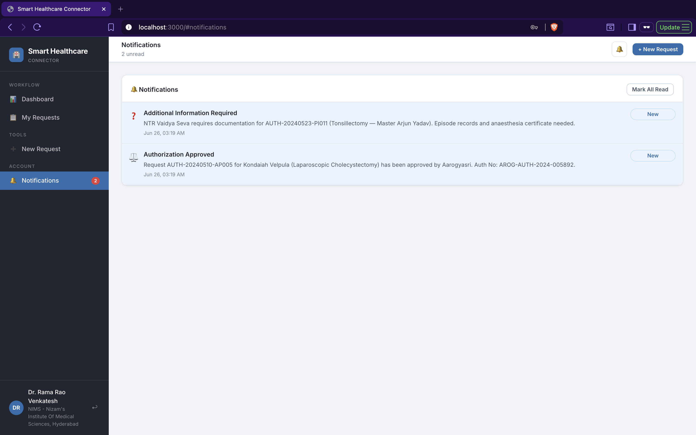            |
| Swagger UI           | 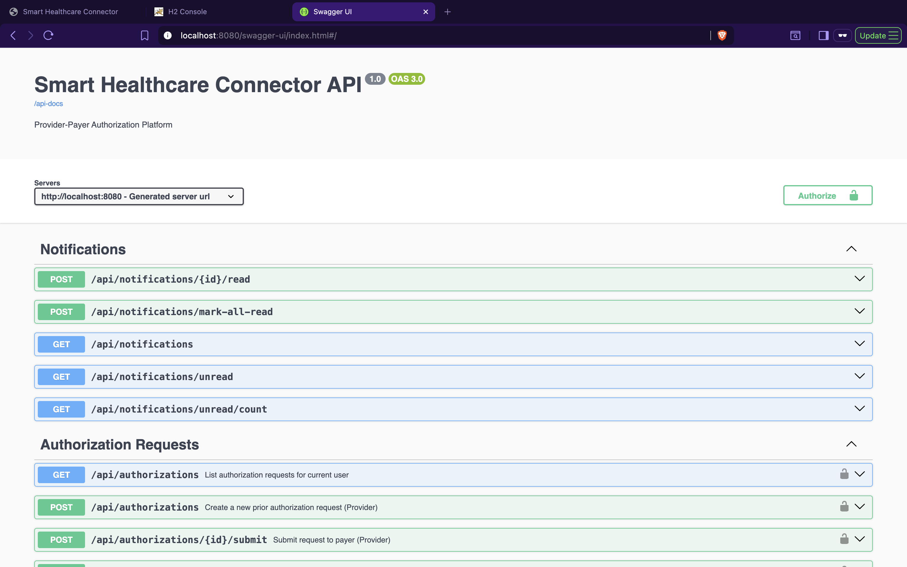                     |
| H2 Console           | 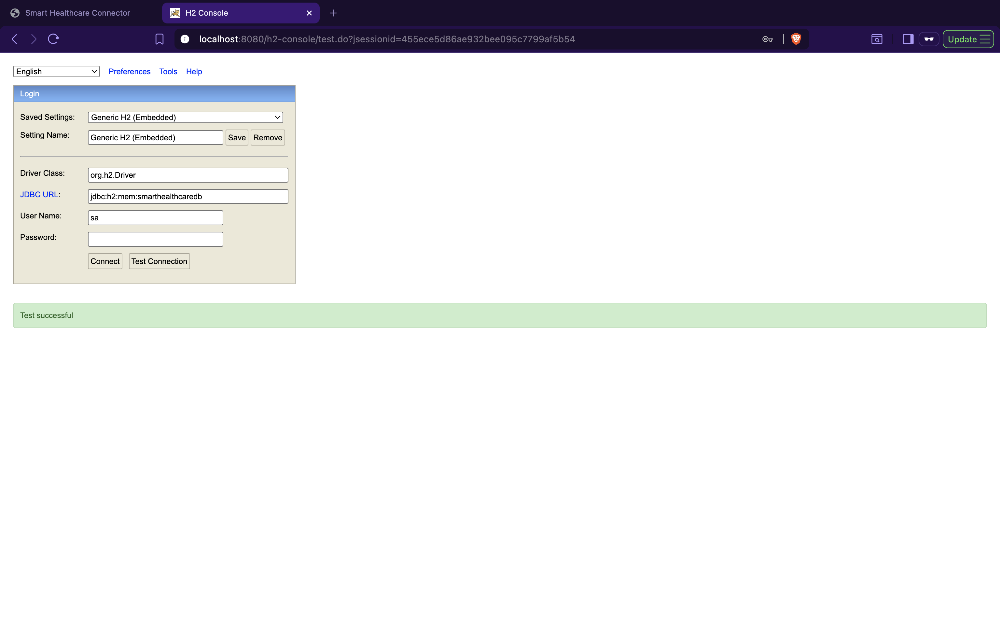                          |
| H2 Console Tables    | 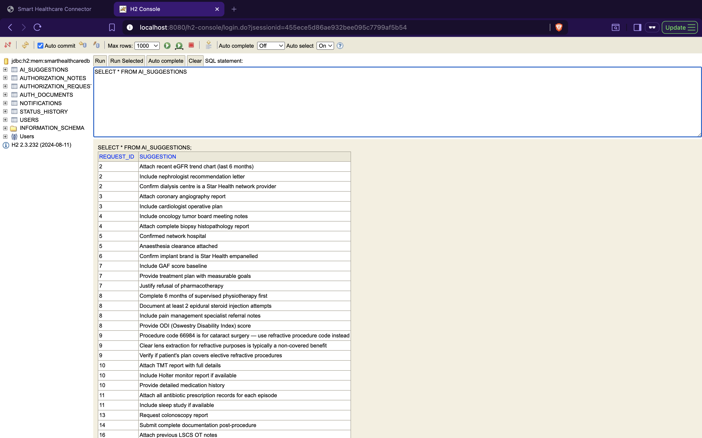                  |

---

## Future Enhancements

<details>
<summary><strong>Infrastructure & DevOps</strong></summary>

- [ ] **PostgreSQL** — Replace H2 with a production-grade relational database
- [ ] **Redis** — Session caching and notification queuing
- [ ] **Docker & Docker Compose** — Containerized deployment
- [ ] **Kubernetes** — Orchestration and auto-scaling
- [ ] **AWS / Azure Deployment** — Cloud hosting with managed services
- [ ] **CI/CD Pipeline** — GitHub Actions for automated testing and deployment

</details>

<details>
<summary><strong>Healthcare & Interoperability</strong></summary>

- [ ] **FHIR Server Integration** — Connect to a live HAPI FHIR server for resource persistence
- [ ] **HL7 v2 Integration** — Inbound HL7 ADT and ORM message processing
- [ ] **FHIR Subscriptions** — Event-driven payer notifications via FHIR R4 Subscription
- [ ] **CDS Hooks** — Clinical Decision Support integration at point-of-care
- [ ] **X12 278 Transaction** — Industry-standard EDI prior authorization exchange

</details>

<details>
<summary><strong>AI & Intelligence</strong></summary>

- [ ] **ML Approval Prediction** — Train models on historical PA decisions
- [ ] **OCR Document Upload** — Extract clinical data from scanned documents
- [ ] **NLP Clinical Notes Parsing** — Structured extraction from free-text notes
- [ ] **Denial Pattern Analysis** — AI-driven insights on denial trends

</details>

<details>
<summary><strong>Platform Features</strong></summary>

- [ ] **Email Notifications** — SMTP-based alerts for status changes
- [ ] **SMS Notifications** — Twilio integration for urgent updates
- [ ] **Multi-Tenant Architecture** — Isolated data per health system
- [ ] **Audit Logging** — Tamper-evident audit trail with timestamps
- [ ] **Rate Limiting** — API throttling and abuse prevention
- [ ] **Role Expansion** — Clinical reviewer, billing coordinator roles

</details>

---

## Author

<div align="center">

**Ganesh Mukhi**

Java Full Stack Developer

[](https://linkedin.com/in/ganesh-mukhi)
[](https://github.com/rondev9)
[](mailto:ganeshnaidumukhi369@gmail.com)

</div>

---

## License

```
MIT License

Copyright (c) 2024 Ganesh Mukhi

Permission is hereby granted, free of charge, to any person obtaining a copy
of this software and associated documentation files (the "Software"), to deal
in the Software without restriction, including without limitation the rights
to use, copy, modify, merge, publish, distribute, sublicense, and/or sell
copies of the Software, and to permit persons to whom the Software is
furnished to do so, subject to the following conditions:

The above copyright notice and this permission notice shall be included in all
copies or substantial portions of the Software.

THE SOFTWARE IS PROVIDED "AS IS", WITHOUT WARRANTY OF ANY KIND, EXPRESS OR
IMPLIED, INCLUDING BUT NOT LIMITED TO THE WARRANTIES OF MERCHANTABILITY,
FITNESS FOR A PARTICULAR PURPOSE AND NONINFRINGEMENT.
```

---

<div align="center">

_Smart Healthcare Connector — Bridging Providers and Payers with AI & FHIR_

</div>
