# Feuji Smart Healthcare Connector — Software Requirements Specification & Technical Design Document
## (Technical Design & Requirements Document)

**AI-Powered Healthcare Provider-Payer Authorization Platform**

| Field | Value |
|:------|:------|
| **Project** | Feuji Smart Healthcare Connector |
| **Client/Sponsor** | Feuji Inc. (https://www.feuji.com/) |
| **Primary Theme** | Feuji Brand Orange (#f3752e) |
| **Version** | 1.0 |
| **Date** | June 2026 |
| **Author** | Avinash Chidurala |
| **Status** | Draft — Awaiting Review |

---

## Technology Stack

| Layer | Technology | Version | Purpose |
|:------|:-----------|:--------|:--------|
| **Frontend** | Angular | 20 | Single Page Application |
| **UI Library** | Angular Material | Latest | Material Design components |
| **Language** | TypeScript | 5.x | Type-safe JavaScript |
| **Backend** | Spring Boot | 3.x | REST API framework |
| **Language** | Java | 21 | Backend language |
| **Security** | Spring Security + JWT | Latest | Authentication & Authorization |
| **ORM** | Spring Data JPA + Hibernate | Latest | Database access |
| **Build Tool** | Maven | 3.9+ | Backend dependency management |
| **Database** | PostgreSQL (NeonDB) | 16 | Serverless relational database |
| **AI** | Google Gemini API | 2.0 Flash | AI Copilot validation |
| **Healthcare** | HAPI FHIR | R4 (7.6.0) | FHIR resource generation |
| **Email** | Spring Boot Mail + Gmail SMTP | Latest | OTP, password reset, notifications |
| **Caching & Rate-Limiting** | Upstash Redis | REST API | Cache payer lookup lists and protect endpoints against abuse |
| **Cloud Storage** | Cloudinary | REST API | Cloud storage for uploaded patient documents and logo assets |
| **API Docs** | Swagger / OpenAPI | 3.0 | REST API documentation |
| **Version Control** | Git + GitHub | Latest | Source control |

---

## Table of Contents

1. [Business Analysis & Assumptions](#1-business-analysis--assumptions)
   * [1.6 Primary Stakeholder & Ecosystem Alignment](#16-primary-stakeholder--ecosystem-alignment)
2. [End-to-End Authorization Workflow](#2-end-to-end-authorization-workflow)
3. [Complete Feature List](#3-complete-feature-list)
4. [Functional Requirements](#4-functional-requirements)
5. [Non-Functional Requirements](#5-non-functional-requirements)
6. [User Roles & Permissions](#6-user-roles--permissions)
7. [Provider Module Breakdown](#7-provider-module-breakdown)
8. [Payer Module Breakdown](#8-payer-module-breakdown)
9. [AI Copilot Features](#9-ai-copilot-features)
10. [Notification Workflow](#10-notification-workflow)
11. [Status Lifecycle](#11-status-lifecycle)
12. [Dashboard Requirements](#12-dashboard-requirements)
    * [12.5 Feuji Brand Design System & UI Theme Guidelines](#125-feuji-brand-design-system--ui-theme-guidelines)
13. [Screen-by-Screen UI Plan](#13-screen-by-screen-ui-plan)
14. [Database Design](#14-database-design)
15. [Entity Relationship Diagram](#15-entity-relationship-diagram)
16. [FHIR Resource Mapping](#16-fhir-resource-mapping)
17. [REST API Specification](#17-rest-api-specification)
18. [Backend Package Structure](#18-backend-package-structure)
19. [Angular Project Structure](#19-angular-project-structure)
20. [Security Architecture](#20-security-architecture)
21. [AI Integration Architecture](#21-ai-integration-architecture)
22. [File Upload Strategy](#22-file-upload-strategy)
23. [Validation Strategy](#23-validation-strategy)
24. [Exception Handling Strategy](#24-exception-handling-strategy)
25. [Logging Strategy](#25-logging-strategy)
26. [Deployment Architecture](#26-deployment-architecture)
27. [Sequence Diagrams](#27-sequence-diagrams)
28. [Activity Diagrams](#28-activity-diagrams)
29. [Component Diagrams](#29-component-diagrams)
30. [Folder Structure](#30-folder-structure)
31. [Development Phases](#31-development-phases)
32. [Sprint-Wise Implementation Plan](#32-sprint-wise-implementation-plan)
33. [Testing Strategy](#33-testing-strategy)
34. [Future Enhancements](#34-future-enhancements)
35. [Demo Scenario](#35-demo-scenario)
36. [Risks & Mitigation](#36-risks--mitigation)
37. [Enterprise-Grade Improvements](#37-enterprise-grade-improvements)

---

## 1. Business Analysis & Assumptions

### 1.1 Business Problem

Healthcare providers (hospitals, clinics) and payers (insurance companies) exchange prior authorization requests as part of the insurance lifecycle. Current systems suffer from:

- **One-way communication** — Providers submit, but lack real-time feedback
- **Incomplete requests** — Missing patient info, insurance details, diagnosis codes, supporting documents
- **Missing procedure details** — Incomplete procedure codes, descriptions, and cost estimates
- **Missing supporting documents** — Lab reports, imaging, clinical records not attached
- **High rejection rates** — Due to preventable data quality issues
- **Delayed approvals** — Multiple back-and-forth communications slow down the process
- **No tracking** — Providers have no visibility into request status
- **Manual validation** — No automated checks before submission
- **Poor communication** — No structured notification system between parties

### 1.2 Business Objective

> **The primary goal of the Feuji Smart Healthcare Connector is to prevent incomplete or incorrect authorization requests from reaching the payer by using AI-assisted validation before submission.**

The platform should leverage Artificial Intelligence (AI Copilot) and FHIR standards to:
- Reduce incomplete authorization requests
- Improve bidirectional communication between providers and payers
- Automate validation and suggest corrections in real-time
- Accelerate insurance approvals
- Provide complete status tracking and notification capabilities

### 1.3 Users

#### 1.3.1 Providers (Healthcare Organizations)

Providers are healthcare organizations that create and submit prior authorization requests.

| # | Provider Type | Example |
|:--|:-------------|:--------|
| 1 | General Hospital | City General Hospital |
| 2 | Multi Specialty Hospital | Apollo Hospitals |
| 3 | Super Specialty Hospital | AIIMS |
| 4 | Dental Clinic | Smile Dental Care |
| 5 | Orthopedic Hospital | Bone & Joint Center |
| 6 | Dermatology Clinic | Skin Care Clinic |
| 7 | Cardiology Hospital | Heart Care Institute |
| 8 | Neurology Hospital | Brain & Spine Center |
| 9 | Gynecology Hospital | Women's Health Clinic |
| 10 | ENT Clinic | ENT Specialty Clinic |
| 11 | Eye Hospital | Vision Eye Care |
| 12 | Pediatric Clinic | Child Health Center |
| 13 | Physiotherapy Center | PhysioFit Rehab |
| 14 | Diagnostic Center | PathLab Diagnostics |
| 15 | Imaging Center | RadiScan Imaging |
| 16 | Pathology Lab | CellPath Labs |

**Provider Responsibilities:**
- Login to the platform
- Create Authorization Request
- Enter Patient Details (name, DOB, gender, contact, address)
- Enter Insurance Details (policy number, group number, subscriber info)
- Enter Diagnosis (ICD-10 codes and descriptions)
- Enter Procedure Details (CPT codes, cost estimate, urgency)
- Upload Required Documents (lab reports, imaging, clinical records)
- Validate Request using AI Copilot (real-time, during form entry)
- Review AI recommendations and apply corrections
- Submit Authorization Request
- Track Request Status on Dashboard
- Receive Notifications on status changes
- Resubmit rejected or info-requested requests

#### 1.3.2 Payers (Insurance Companies)

Payers are insurance companies that review and adjudicate authorization requests.

| # | Payer Name | Type |
|:--|:-----------|:-----|
| 1 | Star Health | Health Insurance |
| 2 | Niva Bupa | Health Insurance |
| 3 | HDFC ERGO | General Insurance |
| 4 | Care Health Insurance | Health Insurance |
| 5 | ICICI Lombard | General Insurance |
| 6 | Tata AIG | General Insurance |

**Payer Responsibilities:**
- Login to the platform
- Review Authorization Requests assigned to their organization
- View AI Validation Summary (quality score, risk level, recommendations)
- Approve Request (with optional remarks)
- Reject Request (with mandatory remarks explaining reason)
- Request Additional Information (with mandatory remarks specifying what's needed)
- Add Review Comments
- Update Authorization Status
- Notify Provider of decision
- Track processed requests on Dashboard

### 1.4 Assumptions

| # | Assumption | Rationale |
|:--|:-----------|:----------|
| A1 | Single-tenant deployment | This is a training/demo project, not multi-tenant SaaS |
| A2 | Providers and Payers self-register | No admin approval workflow for registration |
| A3 | One provider submits to one payer per request | Each authorization targets a single insurance company |
| A4 | File uploads stored locally on server | No cloud storage (S3/GCS) — zero budget constraint |
| A5 | Gemini API free tier is sufficient | Rate limits acceptable for demo (~15 RPM) |
| A6 | No real-time WebSocket push | Notifications via polling (every 30s) — simpler architecture |
| A7 | ICD-10 and CPT codes are user-entered text | No external code lookup API — AI validates format and consistency |
| A8 | FHIR resources are generated for display/export | Not connecting to an external FHIR server |
| A9 | English language only | All UI and AI responses in English |
| A10 | PostgreSQL via NeonDB (free tier) | Serverless PostgreSQL with SSL required |
| A11 | Provider type is selected during registration | Determines contextual AI recommendations |
| A12 | Multiple users can belong to same organization | But each user has independent login |

### 1.5 Proposed Business Rules

| Rule | Description | Justification |
|:-----|:------------|:-------------|
| BR1 | AI validation is mandatory before submission | Prevents incomplete requests — core value proposition |
| BR2 | AI validation runs in real-time while provider fills the form | Key differentiator — catches errors during data entry, not after |
| BR3 | Payer remarks required for REJECTED and INFO_REQUESTED | Forces accountability and clear communication |
| BR4 | Provider can resubmit REJECTED or INFO_REQUESTED requests | Enables correction workflow without creating duplicates |
| BR5 | Request amount must be > 0 | Basic data integrity |
| BR6 | Only the assigned payer can take action on a request | Security and workflow integrity |
| BR7 | Status changes trigger automatic notifications | Both parties stay informed in real-time |
| BR8 | Request is converted to FHIR resources on submission | Ensures healthcare data interoperability |
| BR9 | ClaimResponse FHIR resource generated on payer decision | Complete FHIR lifecycle support |
| BR10 | Requests older than 90 days auto-expire (future) | Prevents stale data accumulation |

### 1.6 Primary Stakeholder & Ecosystem Alignment

Based on the target business ecosystem analysis, the platform design is oriented around the following architectural alignment:
- **Primary Business Domain**: Healthcare insurance prior authorization.
- **Primary Beneficiary/Customer**: Insurance companies (Payers). They receive fewer incomplete requests, reduce administrative overhead, and process claims or prior authorization reviews faster.
- **Primary AI User**: Healthcare Providers (hospitals and clinics), using the AI Copilot to correct requests before submission.
- **Shared Platform Design**: The platform integrates both **Provider** and **Payer** modules to address the insurer's problem by directly improving how providers submit requests.
- **Pitch/Ecosystem Positioning**: 
  > Our platform is designed for the healthcare insurance authorization ecosystem. The primary business objective is to help insurance companies receive complete and accurate authorization requests, while also providing hospitals and clinics with an AI-assisted provider portal to submit those requests correctly. By serving both providers and payers on the same platform, we reduce incomplete submissions, minimize back-and-forth communication, and speed up authorization decisions.

---

## 2. End-to-End Authorization Workflow

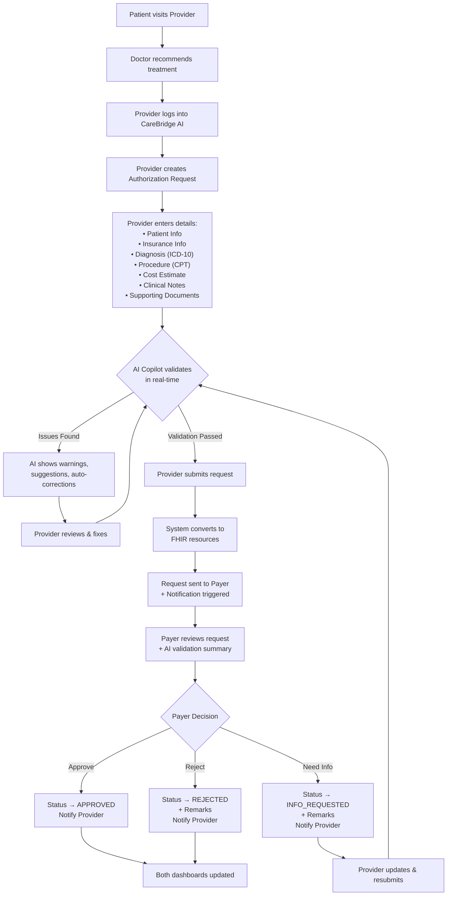

---

## 3. Complete Feature List

### 3.1 Core Features

| ID | Feature | Module | Priority |
|:---|:--------|:-------|:---------|
| F01 | User Registration with Email OTP Verification | Auth | P0 |
| F02 | User Login (JWT) | Auth | P0 |
| F03 | Role-based Access Control | Auth | P0 |
| F04 | Email OTP Verification (Gmail SMTP) | Auth | P0 |
| F05 | Forgot Password / Reset via Email Link | Auth | P0 |
| F06 | Create Authorization Request | Provider | P0 |
| F07 | AI Real-time Validation | Provider | P0 |
| F08 | AI Recommendations & Auto-corrections | Provider | P0 |
| F09 | Submit Authorization Request | Provider | P0 |
| F10 | Upload Supporting Documents | Provider | P0 |
| F11 | View Request List (Provider) | Provider | P0 |
| F12 | Provider Dashboard with Statistics | Provider | P0 |
| F13 | View Request Queue (Payer) | Payer | P0 |
| F14 | Review Request Details | Payer | P0 |
| F15 | Approve / Reject / Request Info | Payer | P0 |
| F16 | Add Payer Remarks | Payer | P0 |
| F17 | Payer Dashboard with Statistics | Payer | P0 |
| F18 | In-app Notifications | Notification | P0 |
| F19 | Email Notifications (Gmail SMTP) | Notification | P0 |
| F20 | Notification Badge (Unread Count) | Notification | P0 |
| F21 | Request Status Tracking | Tracking | P0 |
| F22 | FHIR Resource Generation | FHIR | P1 |
| F23 | View FHIR Bundle (JSON) | FHIR | P1 |
| F24 | Resubmit Rejected/Info-Requested | Provider | P1 |
| F25 | Request Detail with Timeline | Tracking | P1 |
| F26 | Search & Filter Requests | Both | P1 |
| F27 | Swagger API Documentation | Backend | P1 |
| F28 | Seed Data for Testing | Backend | P1 |
| F29 | Logout | Auth | P0 |

---

## 4. Functional Requirements

### FR01 — User Registration with Email OTP
- System shall allow users to register with name, email, password, role (PROVIDER/PAYER), organization name, and provider type (if Provider)
- Email must be unique across all users
- Password must be minimum 8 characters
- On registration, system sends a 6-digit OTP to the user's email via Gmail SMTP
- User must verify email by entering the OTP before account is activated
- OTP expires after 10 minutes
- User can request a new OTP (resend)

### FR02 — User Authentication
- System shall authenticate users via email/password and return a JWT token
- Only email-verified users can login
- JWT token shall expire after 24 hours
- All protected endpoints shall validate the JWT token

### FR03 — Forgot Password / Reset
- User can request a password reset by entering their registered email
- System sends a password reset link to the user's email via Gmail SMTP
- Reset link contains a unique token valid for 30 minutes
- User clicks the link, enters a new password, and the password is updated
- Used reset tokens are invalidated immediately

### FR04 — Create Authorization Request
- Provider shall fill a multi-section form: Patient, Insurance, Diagnosis, Procedure, Cost, Clinical Notes
- All mandatory fields must be validated client-side before AI validation
- Provider must select a target Payer from registered payer list

### FR05 — AI Copilot Validation
- AI validation shall trigger on-demand (button click) during form entry
- AI shall return structured JSON with: missing fields, recommendations, auto-corrections, quality score (0-100), approval probability, risk level
- Results displayed in a side panel alongside the form

### FR06 — Document Upload
- Provider shall upload supporting documents (PDF, JPG, PNG)
- Maximum 5 files per request, each max 5MB
- Files stored on server filesystem with metadata in database

### FR07 — Submit Authorization Request
- System shall save the request with status SUBMITTED
- System shall generate FHIR resources (Patient, Coverage, Claim, Organization, Practitioner, DocumentReference)
- System shall send in-app notification AND email notification to the target Payer

### FR08 — Payer Review
- Payer shall view all requests assigned to their organization
- Payer shall view full request details including AI validation summary
- Payer shall Approve, Reject, or Request Additional Information
- Reject and Info Request actions require mandatory remarks

### FR09 — Notifications (In-App + Email)
- System shall create an in-app notification AND send an email for every status change
- System shall create a notification for Provider when Payer takes action
- System shall create a notification for Payer when Provider submits/resubmits
- In-app notifications show unread count on the navbar bell icon
- User can mark in-app notifications as read
- Email notifications contain request details, status, and a link to the request

### FR10 — Dashboard
- Provider dashboard: Total Requests, Approved, Rejected, Pending, Info Requested counts + recent requests table
- Payer dashboard: Pending Review, Approved Today, Rejected Today, Total Processed counts + request queue

### FR11 — Resubmission
- Provider can update and resubmit requests with status REJECTED or INFO_REQUESTED
- Resubmission resets status to SUBMITTED and triggers new notification (in-app + email) to Payer

### FR12 — Seed Data
- System shall pre-load test data on first startup for demo and validation purposes
- Seed data includes: sample providers, payers, patients, authorization requests in various statuses
- Seed data loaded via a Spring Boot `CommandLineRunner` or `data.sql`

---

## 5. Non-Functional Requirements

| ID | Requirement | Target |
|:---|:-----------|:-------|
| NFR01 | **Response Time** | API responses < 500ms (excluding AI calls) |
| NFR02 | **AI Response Time** | Gemini API call < 10 seconds |
| NFR03 | **Concurrent Users** | Support 20+ simultaneous users |
| NFR04 | **Security** | JWT auth, BCrypt passwords, CORS restricted |
| NFR05 | **Data Integrity** | ACID transactions via PostgreSQL |
| NFR06 | **Availability** | Standard Spring Boot embedded server |
| NFR07 | **Usability** | Intuitive UI with Angular Material, mobile-responsive |
| NFR08 | **Maintainability** | Clean architecture, DTO pattern, layered services |
| NFR09 | **Scalability** | Stateless backend, ready for horizontal scaling |
| NFR10 | **Browser Support** | Chrome, Firefox, Edge (latest 2 versions) |
| NFR11 | **Accessibility** | Angular Material built-in a11y support |
| NFR12 | **API Documentation** | Swagger UI available at `/swagger-ui.html` |

---

## 6. User Roles & Permissions

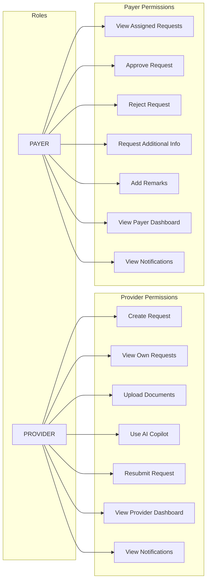

| Permission | PROVIDER | PAYER |
|:-----------|:--------:|:-----:|
| Register / Login | ✅ | ✅ |
| Create Authorization Request | ✅ | ❌ |
| Upload Documents | ✅ | ❌ |
| Trigger AI Validation | ✅ | ❌ |
| Submit / Resubmit Request | ✅ | ❌ |
| View Own Requests | ✅ | ❌ |
| View Assigned Requests | ❌ | ✅ |
| Approve / Reject / Request Info | ❌ | ✅ |
| Add Review Remarks | ❌ | ✅ |
| View Dashboard | ✅ (Provider) | ✅ (Payer) |
| Receive Notifications | ✅ | ✅ |
| View FHIR Resources | ✅ | ✅ |

---

## 7. Provider Module Breakdown

### 7.1 Provider Dashboard
- **Summary Cards**: Total Requests, Approved, Rejected, Pending Review, Info Requested
- **Recent Requests Table**: Last 10 requests with status badges, date, payer name
- **Quick Actions**: "New Request" button
- **Status Distribution Chart**: Pie/donut chart of request statuses

### 7.2 Create Authorization Request (Multi-Step Form)

**Step 1 — Patient Information**
| Field | Type | Required | Validation |
|:------|:-----|:---------|:-----------|
| Patient First Name | Text | Yes | Min 2 chars |
| Patient Last Name | Text | Yes | Min 2 chars |
| Date of Birth | Date | Yes | Must be past date |
| Gender | Select | Yes | Male/Female/Other |
| Phone Number | Text | Yes | 10 digits |
| Email | Email | No | Valid email format |
| Address | Textarea | Yes | Min 10 chars |

**Step 2 — Insurance Information**
| Field | Type | Required | Validation |
|:------|:-----|:---------|:-----------|
| Insurance Company (Payer) | Select | Yes | From registered payers |
| Policy Number | Text | Yes | Alphanumeric |
| Group Number | Text | No | Alphanumeric |
| Subscriber Name | Text | Yes | Min 2 chars |
| Subscriber Relationship | Select | Yes | Self/Spouse/Child/Other |
| Coverage Start Date | Date | Yes | Valid date |
| Coverage End Date | Date | No | After start date |

**Step 3 — Diagnosis Information**
| Field | Type | Required | Validation |
|:------|:-----|:---------|:-----------|
| Primary Diagnosis Code (ICD-10) | Text | Yes | Format: X##.### |
| Primary Diagnosis Description | Text | Yes | Min 5 chars |
| Secondary Diagnosis Code | Text | No | Format: X##.### |
| Secondary Diagnosis Description | Text | No | Min 5 chars if code provided |

**Step 4 — Procedure Information**
| Field | Type | Required | Validation |
|:------|:-----|:---------|:-----------|
| Procedure Code (CPT) | Text | Yes | 5-digit numeric |
| Procedure Description | Text | Yes | Min 5 chars |
| Estimated Cost (₹) | Number | Yes | > 0 |
| Date of Service | Date | Yes | Present or future |
| Urgency | Select | Yes | Routine/Urgent/Emergency |
| Place of Service | Select | Yes | Inpatient/Outpatient/Emergency |

**Step 5 — Clinical Notes & Documents**
| Field | Type | Required | Validation |
|:------|:-----|:---------|:-----------|
| Clinical Notes | Textarea | Yes | Min 20 chars |
| Supporting Documents | File Upload | No | PDF/JPG/PNG, max 5MB each, max 5 files |

**Step 6 — AI Validation & Review**
- "Validate with AI" button triggers Gemini API
- Side panel shows AI results
- Provider reviews, applies corrections
- Submit button enabled after validation

### 7.3 My Requests (List View)
- Table with columns: Request ID, Patient Name, Payer, Status, Date, Amount
- Filter by status, date range, search by patient name
- Click to view detail

### 7.4 Request Detail View
- All submitted information in read-only cards
- Status timeline (visual progress tracker)
- AI validation summary
- Payer remarks (if any)
- FHIR resource view (collapsible JSON)
- Resubmit button (if REJECTED or INFO_REQUESTED)

---

## 8. Payer Module Breakdown

### 8.1 Payer Dashboard
- **Summary Cards**: Pending Review, Approved Today, Rejected Today, Total Processed, Info Requested
- **Request Queue Table**: All assigned requests, sorted by urgency then date
- **Quick Filters**: Pending / All / Urgent

### 8.2 Request Review Page
- Full request details in organized sections
- AI Validation Summary card (quality score, risk level, approval probability)
- Document viewer (view/download uploaded files)
- **Action Panel**:
  - ✅ **Approve** — Green button, optional remarks
  - ❌ **Reject** — Red button, mandatory remarks textarea
  - ℹ️ **Request Info** — Yellow button, mandatory remarks specifying what's needed
- Status history timeline

### 8.3 Processed Requests
- Table of all processed (non-pending) requests
- Filter by status, date, provider

---

## 9. AI Copilot Features

### 9.1 AI Role Definition

> [!IMPORTANT]
> The AI acts as an **Insurance Authorization Assistant**, NOT a medical diagnosis tool. Its purpose is to ensure the authorization request is complete, consistent, and has the highest chance of approval.

> [!TIP]
> **Critical Feature**: AI should perform **real-time validation and recommendation during data entry**, not only after submission. This came directly from the project requirement: *"AI co-pilot validation and recommendation should be there while provider is filling those details."* This is the feature that will make the project stand out during the demo.

### 9.2 Validation Capabilities

The AI validates the following categories:

| Category | What AI Validates |
|:---------|:-----------------|
| **Patient Completeness** | Missing patient name, DOB, gender, address, phone |
| **Insurance Details** | Missing policy number, invalid coverage dates, subscriber details, expired coverage |
| **Provider Details** | Missing provider/hospital information |
| **Diagnosis Validation** | Missing ICD-10 code, invalid format, inconsistent diagnosis-gender (e.g., pregnancy for male patient) |
| **Procedure Validation** | Missing CPT code, invalid format, procedure-diagnosis mismatch |
| **Cost Validation** | Suspicious or incorrect claim amounts (too high/low for procedure type) |
| **Clinical Notes** | Too short, missing key clinical information, incomplete justification |
| **Document Validation** | Missing mandatory supporting documents for the procedure type |
| **Duplicate Detection** | Flag if similar request was recently submitted for same patient |
| **Mandatory Fields** | Any missing mandatory fields across all sections |
| **Clinical Inconsistencies** | Basic clinical checks (e.g., pregnancy diagnosis for a male patient, pediatric procedure for elderly patient) |

### 9.3 AI Recommendations

The AI should provide the following outputs:

| Output | Description |
|:-------|:------------|
| **Missing Fields** | List of fields that are empty or incomplete |
| **Required Documents** | Documents needed for the specific procedure type |
| **Recommendations** | Suggestions to improve the request quality |
| **Auto-correction Suggestions** | Proposed fixes with "Apply" button (e.g., correcting diagnosis description to match ICD-10 code) |
| **ICD-10 Code Validation** | Verify ICD-10 code format and suggest matching descriptions |
| **CPT Code Validation** | Verify CPT code format and check procedure-diagnosis alignment |
| **Clinical Summary** | AI-generated summary of the clinical case |
| **Approval Probability** | Estimated likelihood of approval (HIGH / MEDIUM / LOW) |
| **Quality Score** | Overall request quality score (0-100) |
| **Risk Level** | Risk assessment (LOW / MEDIUM / HIGH / CRITICAL) |
| **Reasons Behind Recommendations** | Explanation for each recommendation |

### 9.4 AI Response Structure (Structured JSON)

The AI must return structured JSON that the frontend can parse and display:

```json
{
  "qualityScore": 85,
  "approvalProbability": "HIGH",
  "riskLevel": "LOW",
  "overallStatus": "NEEDS_ATTENTION",
  "missingFields": [
    {
      "field": "secondaryDiagnosisCode",
      "severity": "WARNING",
      "message": "Consider adding secondary diagnosis for comprehensive coverage"
    },
    {
      "field": "supportingDocuments",
      "severity": "ERROR",
      "message": "X-ray report is required for orthopedic procedures"
    }
  ],
  "recommendations": [
    {
      "category": "DIAGNOSIS",
      "message": "ICD-10 code M17.11 is typically associated with primary osteoarthritis of the right knee. Verify laterality.",
      "suggestion": "Confirm the diagnosis matches the planned procedure side",
      "reason": "Laterality mismatch can lead to claim denial"
    },
    {
      "category": "PROCEDURE",
      "message": "CPT 27447 (Total Knee Arthroplasty) is consistent with diagnosis M17.11.",
      "suggestion": "Procedure-diagnosis alignment verified",
      "reason": "Matching codes increase approval probability"
    }
  ],
  "autoCorrections": [
    {
      "field": "diagnosisDescription",
      "currentValue": "knee pain",
      "suggestedValue": "Primary osteoarthritis, right knee",
      "reason": "Aligning description with ICD-10 code M17.11 for accuracy"
    }
  ],
  "clinicalSummary": "Patient presents with right knee osteoarthritis requiring total knee replacement. Documentation supports medical necessity. Conservative treatments have been exhausted.",
  "requiredDocuments": [
    "X-ray report of the affected knee",
    "Previous conservative treatment records",
    "Pre-operative blood work results"
  ],
  "warnings": [
    {
      "type": "COST_ALERT",
      "message": "Estimated cost of ₹3,50,000 is within the expected range for total knee arthroplasty"
    },
    {
      "type": "COVERAGE_CHECK",
      "message": "Verify coverage end date is after the planned service date"
    }
  ]
}
```

### 9.5 AI Prompt Engineering

The Gemini API will receive a detailed structured system prompt:

```
You are an Insurance Authorization Assistant for healthcare prior authorization requests.
You are NOT a medical diagnosis tool. You validate insurance paperwork completeness.

Your job is to review the authorization request data and:
1. Identify missing mandatory fields (patient info, insurance, diagnosis, procedure)
2. Validate ICD-10 code format (pattern: X##.###) and check consistency with diagnosis description
3. Validate CPT code format (5-digit numeric) and check alignment with diagnosis
4. Detect data inconsistencies (e.g., pregnancy diagnosis for male patient, pediatric procedure for elderly)
5. Evaluate whether the claim amount is reasonable for the procedure type
6. Identify missing supporting documents based on the procedure type
7. Check if clinical notes are sufficient to support medical necessity
8. Detect potential duplicate requests
9. Generate a clinical summary
10. Estimate approval probability (HIGH/MEDIUM/LOW)
11. Calculate a quality score (0-100)
12. Assess risk level (LOW/MEDIUM/HIGH/CRITICAL)
13. Provide auto-correction suggestions where possible
14. Explain the reason behind every recommendation

Respond ONLY in the specified JSON format below. Do not include markdown formatting,
code blocks, or any text outside the JSON structure.

Required JSON response format:
{
  "qualityScore": <number 0-100>,
  "approvalProbability": "<HIGH|MEDIUM|LOW>",
  "riskLevel": "<LOW|MEDIUM|HIGH|CRITICAL>",
  "overallStatus": "<PASS|NEEDS_ATTENTION|CRITICAL_ISSUES>",
  "missingFields": [{"field": "", "severity": "ERROR|WARNING", "message": ""}],
  "recommendations": [{"category": "", "message": "", "suggestion": "", "reason": ""}],
  "autoCorrections": [{"field": "", "currentValue": "", "suggestedValue": "", "reason": ""}],
  "clinicalSummary": "",
  "requiredDocuments": [""],
  "warnings": [{"type": "", "message": ""}]
}

Input data:
{request_json}
```

### 9.6 Real-Time AI Validation Flow

> [!IMPORTANT]
> The AI Copilot panel is always visible alongside the form. Provider can click "Validate with AI" at any step to get immediate feedback. The AI validates whatever data is filled so far and provides incremental guidance.

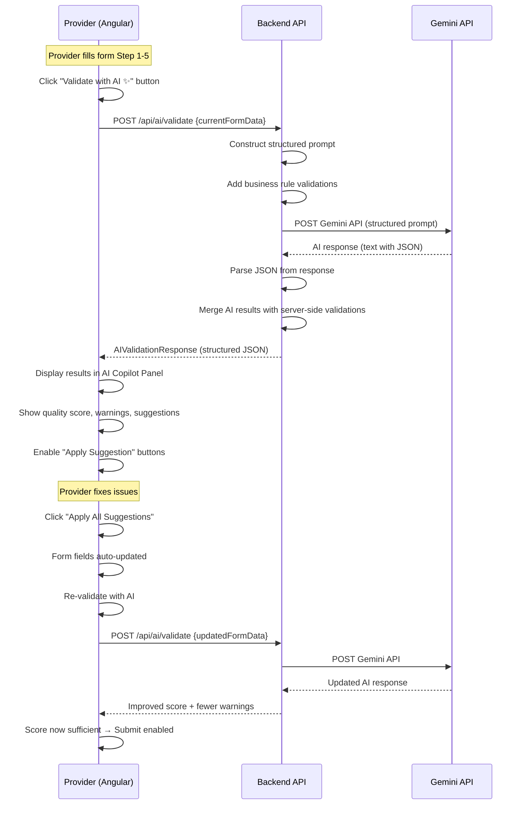

### 9.7 AI Validation During Form Entry (Key Differentiator)

The AI copilot panel appears on the right side (40% width) of the request form. It works as follows:

| Behavior | Description |
|:---------|:------------|
| **Panel Position** | Fixed right panel alongside the multi-step form |
| **Trigger** | "Validate with AI ✨" button (available at every step) |
| **Debounce** | 3-second cooldown between validation calls |
| **Incremental** | Validates whatever data is entered so far; doesn't require all fields |
| **Score Display** | Circular progress indicator showing quality score (0-100) |
| **Color Coding** | Red (0-40), Orange (41-70), Green (71-100) |
| **Apply Suggestions** | Each auto-correction has an "Apply" button that updates the form field |
| **Apply All** | "Apply All Suggestions" button applies all auto-corrections at once |
| **Submit Gate** | Submit button disabled until AI validation has been run at least once |

---

## 10. Notification Workflow

### 10.1 Dual Notification System (In-App + Email)

Every notification is delivered through **two channels simultaneously**:
1. **In-App Notification** — Stored in database, displayed via bell icon in navbar
2. **Email Notification** — Sent via Gmail SMTP to the user's registered email

### 10.2 Notification Triggers

| Event | Recipient | In-App | Email | Message Template |
|:------|:----------|:------:|:-----:|:----------------|
| Email OTP (Registration) | New User | ❌ | ✅ | "Your CareBridge AI verification code is: {otp}" |
| Password Reset Link | User | ❌ | ✅ | "Click here to reset your password: {link}" |
| Request Submitted | Payer | ✅ | ✅ | "New authorization request #REQ-{id} from {provider} for patient {patient}" |
| Request Approved | Provider | ✅ | ✅ | "Authorization request #REQ-{id} has been APPROVED by {payer}" |
| Request Rejected | Provider | ✅ | ✅ | "Authorization request #REQ-{id} has been REJECTED by {payer}. Review remarks." |
| Info Requested | Provider | ✅ | ✅ | "Additional information requested for #REQ-{id} by {payer}" |
| Request Resubmitted | Payer | ✅ | ✅ | "Authorization request #REQ-{id} has been resubmitted by {provider}" |

### 10.3 Email Templates & Corporate Branding

All registration, login, OTP verification, password resets, and request status notification emails are sent using a highly polished HTML design:
- **Color Theme**: Deep Navy/Black background (`#0b1329` / `#121212`) for headers and footers, white content bodies, and Feuji Orange (`#f3752e`) accents/call-to-action buttons.
- **Embedded Logo**: Serves the Feuji corporate logo hosted on Cloudinary: `https://res.cloudinary.com/dgdr3vwoy/image/upload/v1782504477/feuji_logo.png`.
- **Core Values Banner**: Every email displays Feuji's core values in the footer:
  > *Wow the customer | Simpler is better | Walk the talk | Spread the cheer | Pay it forward*
- **Support & Location Info**:
  - Support: [support@Avinash.feuji.com](mailto:support@Avinash.feuji.com)
  - Websites: [feuji.com](https://www.feuji.com) | [feuji.ai](https://www.feuji.ai)
  - Address: *Hetero Wing, Commerzone, Level 16, Hyderabad Knowledge City, Hyderabad, Telangana – 500081*

### 10.4 Gmail SMTP & Email Credentials

```properties
spring.mail.host=smtp.gmail.com
spring.mail.port=587
spring.mail.username=${GMAIL_USERNAME}
spring.mail.password=${GMAIL_APP_PASSWORD}
spring.mail.properties.mail.smtp.auth=true
spring.mail.properties.mail.smtp.starttls.enable=true
spring.mail.properties.mail.smtp.starttls.required=true
```

> [!IMPORTANT]
> **Gmail App Password**: You must generate an App Password from your Google Account (Security → 2-Step Verification → App Passwords). Regular Gmail passwords will NOT work with SMTP.

### 10.5 In-App Notification Lifecycle

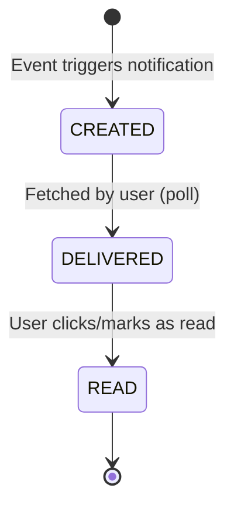

### 10.6 Implementation
- Backend: `NotificationService.createNotification()` creates in-app notification
- Backend: `EmailService.sendNotificationEmail()` sends email via Gmail SMTP (async, non-blocking)
- Both called from `AuthorizationRequestService` on status change
- Frontend: `NotificationService` polls `GET /api/notifications/unread-count` every 30 seconds
- UI: Bell icon in navbar with badge count; dropdown shows recent notifications
- Emails sent asynchronously using `@Async` to prevent blocking the main thread

---

## 11. Status Lifecycle

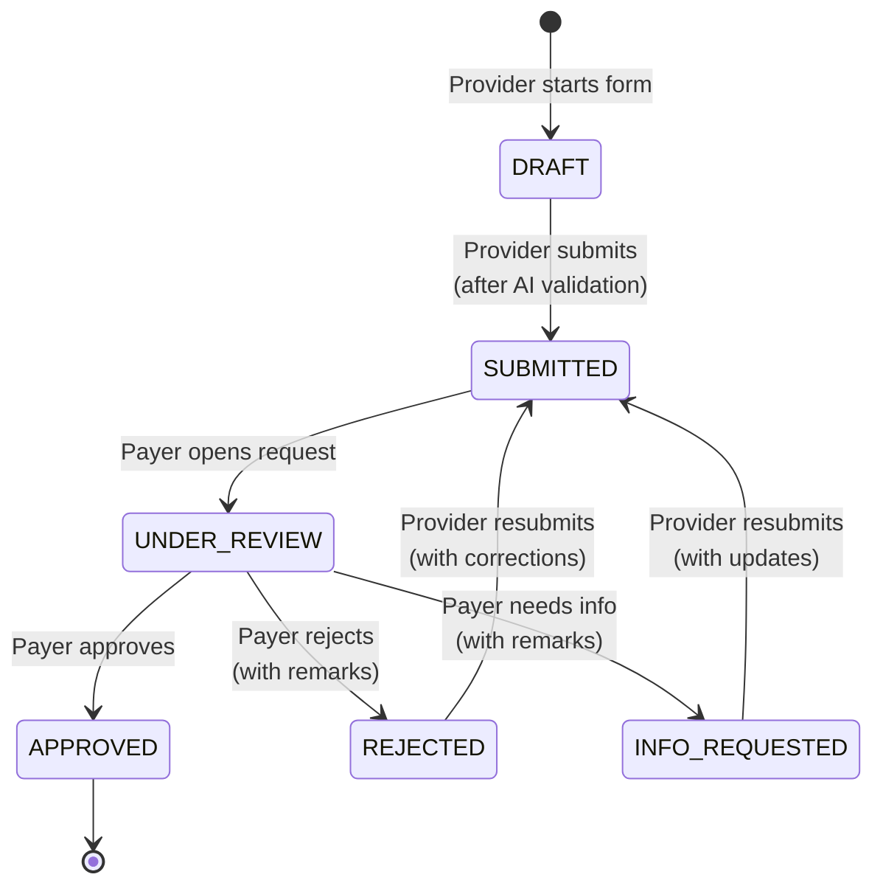

| Status | Display Color | Description |
|:-------|:-------------|:------------|
| `DRAFT` | Gray | Saved but not submitted |
| `SUBMITTED` | Blue | Sent to payer, awaiting review |
| `UNDER_REVIEW` | Yellow/Amber | Payer has opened and is reviewing |
| `APPROVED` | Green | Payer approved the authorization |
| `REJECTED` | Red | Payer rejected with remarks |
| `INFO_REQUESTED` | Orange | Payer needs additional information |

---

## 12. Dashboard Requirements

### 12.1 Provider Dashboard

| Component | Data Source | Behavior |
|:----------|:-----------|:---------|
| Total Requests Card | Count all provider's requests | Click → My Requests |
| Approved Card | Count by status=APPROVED | Click → Filtered list |
| Rejected Card | Count by status=REJECTED | Click → Filtered list |
| Pending Card | Count by status IN (SUBMITTED, UNDER_REVIEW) | Click → Filtered list |
| Info Requested Card | Count by status=INFO_REQUESTED | Click → Filtered list |
| Recent Requests Table | Last 10 requests, ordered by date | Paginated |
| Status Distribution | Pie chart of all statuses | Interactive |

### 12.2 Payer Dashboard

| Component | Data Source | Behavior |
|:----------|:-----------|:---------|
| Pending Review Card | Count by status IN (SUBMITTED, UNDER_REVIEW) | Click → Queue |
| Approved Today Card | Count APPROVED where date = today | — |
| Rejected Today Card | Count REJECTED where date = today | — |
| Total Processed Card | Count all non-pending requests | — |
| Request Queue Table | Pending requests, sorted by urgency | Clickable rows |
| Urgency Indicators | Color-coded: Emergency (red), Urgent (orange), Routine (blue) | — |

---

## 12.5 Feuji Brand Design System & UI Theme Guidelines

To align with the brand identity of **Feuji Inc.** (https://www.feuji.com/), the application's user interface will adopt a highly polished, professional, and modern design system built around the official Feuji color palette and design values:

### 12.5.1 Color Palette
- **Primary Brand Color (Feuji Orange)**: `#f3752e` (RGB: `243, 117, 46`, HSL: `22°, 90%, 57%`). Used for primary action buttons, active states, key focus headers, validation score indicators, and important highlights.
- **Secondary Brand Color (Dark Slate/Navy)**: `#0b1329` (RGB: `11, 19, 41`). Used for main app sidebars, toolbars, headings, and premium contrast containers.
- **Neutral Backgrounds**:
  - **Light Mode**: Off-White (`#f8fafc` / `#ffffff`) with subtle cool-gray borders (`#e2e8f0`).
  - **Dark Mode / Contrast Areas**: Slate Dark (`#0f172a` / `#1e293b`).
- **Accent/Status Colors**:
  - **Approved**: Emerald Green (`#10b981`)
  - **Pending/Submitted**: Soft Info Blue (`#0ea5e9`)
  - **Under Review**: Amber Yellow (`#f59e0b`)
  - **Rejected**: Coral Red (`#ef4444`)
  - **Info Requested**: Indigo Purple (`#6366f1`)

### 12.5.2 Brand Logo & Typography
- **Logo Integration**: The official Feuji logo (loaded from `assets/images/logo.png`) will be integrated into the login page header, the left navigation sidebar, and HTML email templates.
- **Typography**: Clean, professional sans-serif typeface, preferring **Outfit** or **Inter** (loaded via Google Fonts) for headings and UI copy, ensuring excellent readability in healthcare settings.

### 12.5.3 Aesthetics & Motion
- **Glassmorphism**: Subtle backdrops with transparency, blur, and border-radius on cards (e.g. AI Copilot panel) to give a modern, premium feel.
- **Micro-animations**:
  - Hover states on buttons and dashboard cards should use smooth scaling (`transform: scale(1.02)`) and light shadow transitions.
  - Floating action buttons and badges will fade in/out using CSS `transition: all 0.3s ease-in-out`.
  - Circular progress meters for AI validation scores (0-100) will animate on load.

---

## 13. Screen-by-Screen UI Plan

### 13.1 Screen Inventory

| # | Screen | Route | Role | Description |
|:--|:-------|:------|:-----|:------------|
| S01 | Login | `/login` | All | Email + password + role selector |
| S02 | Register | `/register` | All | Registration form |
| S03 | Provider Dashboard | `/provider/dashboard` | Provider | Stats + recent requests |
| S04 | New Request | `/provider/requests/new` | Provider | Multi-step form + AI panel |
| S05 | My Requests | `/provider/requests` | Provider | Request list + filters |
| S06 | Request Detail (Provider) | `/provider/requests/:id` | Provider | Full details + timeline + resubmit |
| S07 | Payer Dashboard | `/payer/dashboard` | Payer | Stats + request queue |
| S08 | Request Review | `/payer/requests/:id` | Payer | Details + action buttons |
| S09 | Payer Request List | `/payer/requests` | Payer | All assigned requests + filters |
| S10 | Notifications | Dropdown (navbar) | All | Notification list |
| S11 | FHIR View | Modal in Detail | All | FHIR JSON viewer |

### 13.2 Screen Wireframe Descriptions

**S01 — Login Page**
- Centered card on gradient background
- CareBridge AI logo + tagline
- Email input, password input, "Login" button
- "Don't have an account? Register" link
- Material Design styling

**S04 — New Authorization Request (Key Screen)**
```
┌──────────────────────────────────────────────────────────────┐
│  NAVBAR  [CareBridge AI]            🔔(3)  [Dr. Smith ▼]    │
├──────────────────────────┬───────────────────────────────────┤
│                          │                                   │
│  STEPPER (Left 60%)      │  AI COPILOT PANEL (Right 40%)     │
│                          │                                   │
│  ① Patient Info          │  ┌─────────────────────────────┐  │
│  ② Insurance Info        │  │  🤖 AI Copilot              │  │
│  ③ Diagnosis             │  │                             │  │
│  ④ Procedure             │  │  Quality Score: 85/100      │  │
│  ⑤ Clinical Notes        │  │  Approval Probability: HIGH │  │
│  ⑥ Review & Submit       │  │  Risk Level: LOW            │  │
│                          │  │                             │  │
│  ┌─────────────────────┐ │  │  ⚠ Warnings (2)            │  │
│  │ Patient First Name* │ │  │  ✅ Recommendations (3)     │  │
│  │ [_______________]   │ │  │  🔄 Auto-corrections (1)   │  │
│  │                     │ │  │                             │  │
│  │ Patient Last Name*  │ │  │  [Apply All Suggestions]    │  │
│  │ [_______________]   │ │  └─────────────────────────────┘  │
│  │                     │ │                                   │
│  │ Date of Birth*      │ │  [Validate with AI ✨]            │
│  │ [_______________]   │ │                                   │
│  │                     │ │                                   │
│  │ [Back] [Next →]     │ │                                   │
│  └─────────────────────┘ │                                   │
└──────────────────────────┴───────────────────────────────────┘
```

**S08 — Payer Request Review (Key Screen)**
```
┌──────────────────────────────────────────────────────────────┐
│  NAVBAR  [CareBridge AI]            🔔(5)  [ICICI ▼]        │
├──────────────────────────────────────────────────────────────┤
│  ← Back to Queue                     Request #REQ-1042       │
├──────────────────────────┬───────────────────────────────────┤
│                          │                                   │
│  REQUEST DETAILS         │  AI VALIDATION SUMMARY            │
│  (Scrollable sections)   │                                   │
│                          │  Quality Score: 92/100 ████████░░ │
│  📋 Patient Information  │  Approval Probability: HIGH       │
│  📄 Insurance Details    │  Risk Level: LOW                  │
│  🏥 Diagnosis            │                                   │
│  💊 Procedure            │  STATUS TIMELINE                  │
│  📝 Clinical Notes       │  ● Submitted — Jun 26, 10:30 AM  │
│  📎 Documents (3 files)  │  ● Under Review — Jun 26, 11:00  │
│                          │                                   │
│                          │  ACTIONS                          │
│                          │  ┌─────────────────────────────┐  │
│                          │  │ Remarks:                    │  │
│                          │  │ [________________________]  │  │
│                          │  │ [________________________]  │  │
│                          │  │                             │  │
│                          │  │ [✅ Approve] [❌ Reject]    │  │
│                          │  │ [ℹ️ Request Info]           │  │
│                          │  └─────────────────────────────┘  │
└──────────────────────────┴───────────────────────────────────┘
```

---

## 14. Database Design

### 14.1 Tables

#### `users`
| Column | Type | Constraints | Description |
|:-------|:-----|:------------|:------------|
| id | BIGSERIAL | PK | Auto-generated ID |
| name | VARCHAR(100) | NOT NULL | Full name |
| email | VARCHAR(150) | UNIQUE, NOT NULL | Login email |
| password | VARCHAR(255) | NOT NULL | BCrypt hashed |
| role | VARCHAR(20) | NOT NULL | PROVIDER / PAYER |
| organization_name | VARCHAR(200) | NOT NULL | Hospital or insurance company name |
| provider_type | VARCHAR(100) | NULLABLE | E.g., "General Hospital", "Dental Clinic" (only for Providers) |
| phone | VARCHAR(15) | NULLABLE | Contact phone |
| email_verified | BOOLEAN | DEFAULT FALSE | Email verification status |
| created_at | TIMESTAMP | DEFAULT NOW() | Registration timestamp |
| updated_at | TIMESTAMP | DEFAULT NOW() | Last update |

#### `email_verifications`
| Column | Type | Constraints | Description |
|:-------|:-----|:------------|:------------|
| id | BIGSERIAL | PK | Auto-generated ID |
| user_id | BIGINT | FK → users(id), NOT NULL | User being verified |
| otp_code | VARCHAR(6) | NOT NULL | 6-digit OTP code |
| expires_at | TIMESTAMP | NOT NULL | OTP expiry time (created_at + 10 min) |
| verified | BOOLEAN | DEFAULT FALSE | Whether OTP was used |
| created_at | TIMESTAMP | DEFAULT NOW() | When OTP was generated |

#### `password_reset_tokens`
| Column | Type | Constraints | Description |
|:-------|:-----|:------------|:------------|
| id | BIGSERIAL | PK | Auto-generated ID |
| user_id | BIGINT | FK → users(id), NOT NULL | User requesting reset |
| token | VARCHAR(255) | UNIQUE, NOT NULL | UUID reset token |
| expires_at | TIMESTAMP | NOT NULL | Token expiry (created_at + 30 min) |
| used | BOOLEAN | DEFAULT FALSE | Whether token was consumed |
| created_at | TIMESTAMP | DEFAULT NOW() | When token was generated |

#### `authorization_requests`
| Column | Type | Constraints | Description |
|:-------|:-----|:------------|:------------|
| id | BIGSERIAL | PK | Request ID |
| provider_id | BIGINT | FK → users(id), NOT NULL | Submitting provider |
| payer_id | BIGINT | FK → users(id), NOT NULL | Target payer/insurer |
| status | VARCHAR(20) | NOT NULL, DEFAULT 'DRAFT' | Current status |
| patient_first_name | VARCHAR(100) | NOT NULL | Patient first name |
| patient_last_name | VARCHAR(100) | NOT NULL | Patient last name |
| patient_dob | DATE | NOT NULL | Date of birth |
| patient_gender | VARCHAR(10) | NOT NULL | Male/Female/Other |
| patient_phone | VARCHAR(15) | NOT NULL | Patient contact |
| patient_email | VARCHAR(150) | NULLABLE | Patient email |
| patient_address | TEXT | NOT NULL | Full address |
| insurance_policy_number | VARCHAR(50) | NOT NULL | Policy/member ID |
| insurance_group_number | VARCHAR(50) | NULLABLE | Group number |
| subscriber_name | VARCHAR(100) | NOT NULL | Policy holder name |
| subscriber_relationship | VARCHAR(20) | NOT NULL | Self/Spouse/Child/Other |
| coverage_start_date | DATE | NOT NULL | Policy start date |
| coverage_end_date | DATE | NULLABLE | Policy end date |
| primary_diagnosis_code | VARCHAR(10) | NOT NULL | ICD-10 code |
| primary_diagnosis_desc | TEXT | NOT NULL | Diagnosis description |
| secondary_diagnosis_code | VARCHAR(10) | NULLABLE | Secondary ICD-10 |
| secondary_diagnosis_desc | TEXT | NULLABLE | Secondary description |
| procedure_code | VARCHAR(10) | NOT NULL | CPT code |
| procedure_description | TEXT | NOT NULL | Procedure description |
| estimated_cost | DECIMAL(12,2) | NOT NULL | Estimated cost (₹) |
| service_date | DATE | NOT NULL | Planned service date |
| urgency | VARCHAR(20) | NOT NULL | ROUTINE/URGENT/EMERGENCY |
| place_of_service | VARCHAR(20) | NOT NULL | INPATIENT/OUTPATIENT/EMERGENCY |
| clinical_notes | TEXT | NOT NULL | Clinical justification |
| payer_remarks | TEXT | NULLABLE | Payer review comments |
| ai_validation_notes | TEXT | NULLABLE | Stored AI validation JSON |
| ai_quality_score | INTEGER | NULLABLE | 0-100 score |
| fhir_bundle_json | TEXT | NULLABLE | Generated FHIR Bundle |
| created_at | TIMESTAMP | DEFAULT NOW() | Submission time |
| updated_at | TIMESTAMP | DEFAULT NOW() | Last update |

#### `documents`
| Column | Type | Constraints | Description |
|:-------|:-----|:------------|:------------|
| id | BIGSERIAL | PK | Document ID |
| request_id | BIGINT | FK → authorization_requests(id), NOT NULL | Parent request |
| file_name | VARCHAR(255) | NOT NULL | Original filename |
| file_type | VARCHAR(50) | NOT NULL | MIME type |
| file_path | VARCHAR(500) | NOT NULL | Server storage path |
| file_size | BIGINT | NOT NULL | Size in bytes |
| uploaded_at | TIMESTAMP | DEFAULT NOW() | Upload time |

#### `notifications`
| Column | Type | Constraints | Description |
|:-------|:-----|:------------|:------------|
| id | BIGSERIAL | PK | Notification ID |
| user_id | BIGINT | FK → users(id), NOT NULL | Recipient |
| request_id | BIGINT | FK → authorization_requests(id), NULLABLE | Related request |
| title | VARCHAR(200) | NOT NULL | Short title |
| message | TEXT | NOT NULL | Full message |
| type | VARCHAR(30) | NOT NULL | SUBMISSION/APPROVAL/REJECTION/INFO_REQUEST/RESUBMISSION |
| is_read | BOOLEAN | DEFAULT FALSE | Read status |
| created_at | TIMESTAMP | DEFAULT NOW() | Creation time |

#### `status_history`
| Column | Type | Constraints | Description |
|:-------|:-----|:------------|:------------|
| id | BIGSERIAL | PK | History ID |
| request_id | BIGINT | FK → authorization_requests(id), NOT NULL | Parent request |
| from_status | VARCHAR(20) | NULLABLE | Previous status (null for creation) |
| to_status | VARCHAR(20) | NOT NULL | New status |
| changed_by | BIGINT | FK → users(id), NOT NULL | Who changed it |
| remarks | TEXT | NULLABLE | Optional remarks |
| changed_at | TIMESTAMP | DEFAULT NOW() | When changed |

---

## 15. Entity Relationship Diagram

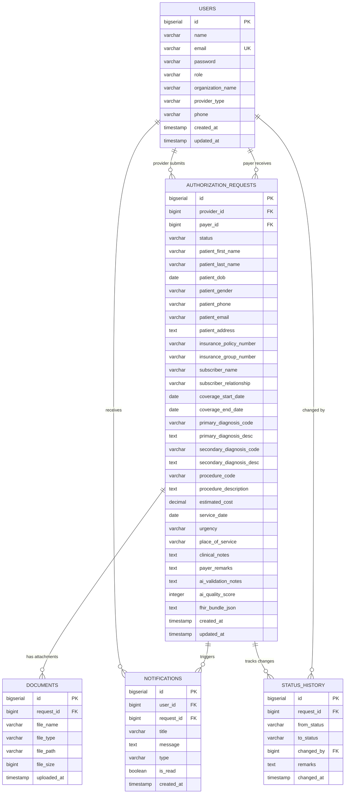

---

## 16. FHIR Resource Mapping

### 16.1 Business-to-FHIR Mapping

| Business Entity | FHIR Resource (R4) | Key Fields Mapped |
|:----------------|:-------------------|:------------------|
| Patient Info | `Patient` | name, birthDate, gender, telecom, address |
| Provider/Hospital | `Organization` (type=prov) | name, type, telecom, address |
| Doctor/Practitioner | `Practitioner` | name, qualification (from logged-in provider user) |
| Insurance Policy | `Coverage` | subscriber, beneficiary, payor, period, class (policy/group) |
| Insurance Company | `Organization` (type=pay) | name, type |
| Authorization Request | `Claim` | use=preauthorization, patient, provider, insurer, diagnosis (ICD-10), item (CPT), total |
| Payer Decision | `ClaimResponse` | status, type, use=preauthorization, patient, insurer, outcome (complete/error/partial), disposition, processNote |
| Uploaded Reports | `DocumentReference` | status, type, content (attachment), subject (patient reference) |

### 16.2 FHIR Resource Details

#### Patient Resource
```json
{
  "resourceType": "Patient",
  "name": [{ "family": "Kumar", "given": ["Rajesh"] }],
  "birthDate": "1975-03-15",
  "gender": "male",
  "telecom": [{ "system": "phone", "value": "9876543210" }],
  "address": [{ "text": "123 Main Street, Hyderabad" }]
}
```

#### Claim Resource (Prior Authorization)
```json
{
  "resourceType": "Claim",
  "status": "active",
  "type": { "coding": [{ "system": "http://terminology.hl7.org/CodeSystem/claim-type", "code": "institutional" }] },
  "use": "preauthorization",
  "patient": { "reference": "Patient/1" },
  "provider": { "reference": "Organization/1" },
  "insurer": { "reference": "Organization/2" },
  "diagnosis": [{
    "sequence": 1,
    "diagnosisCodeableConcept": {
      "coding": [{ "system": "http://hl7.org/fhir/sid/icd-10", "code": "M17.11", "display": "Primary osteoarthritis, right knee" }]
    }
  }],
  "item": [{
    "sequence": 1,
    "productOrService": {
      "coding": [{ "system": "http://www.ama-assn.org/go/cpt", "code": "27447", "display": "Total knee arthroplasty" }]
    },
    "unitPrice": { "value": 350000, "currency": "INR" }
  }],
  "total": { "value": 350000, "currency": "INR" }
}
```

#### ClaimResponse Resource (Payer Decision)
```json
{
  "resourceType": "ClaimResponse",
  "status": "active",
  "type": { "coding": [{ "code": "institutional" }] },
  "use": "preauthorization",
  "patient": { "reference": "Patient/1" },
  "insurer": { "reference": "Organization/2" },
  "outcome": "complete",
  "disposition": "Authorization granted. Valid for 30 days.",
  "processNote": [{ "text": "All documentation verified. Procedure approved." }]
}
```

### 16.3 FHIR Bundle Generation

When a provider submits a request, the system generates a FHIR `Bundle` of type `collection` containing all related resources. This bundle is stored as JSON in the `fhir_bundle_json` column and can be viewed in the UI.

**On Submission (Provider):**
```json
{
  "resourceType": "Bundle",
  "type": "collection",
  "entry": [
    { "resource": { "resourceType": "Patient" } },
    { "resource": { "resourceType": "Organization", "type": "provider" } },
    { "resource": { "resourceType": "Practitioner" } },
    { "resource": { "resourceType": "Organization", "type": "payer" } },
    { "resource": { "resourceType": "Coverage" } },
    { "resource": { "resourceType": "Claim", "use": "preauthorization" } },
    { "resource": { "resourceType": "DocumentReference" } }
  ]
}
```

**On Payer Decision (ClaimResponse added):**
When the payer approves/rejects, a `ClaimResponse` resource is generated and appended to the bundle.

### 16.4 HAPI FHIR Dependency

```xml
<dependency>
    <groupId>ca.uhn.hapi.fhir</groupId>
    <artifactId>hapi-fhir-structures-r4</artifactId>
    <version>7.6.0</version>
</dependency>
<dependency>
    <groupId>ca.uhn.hapi.fhir</groupId>
    <artifactId>hapi-fhir-base</artifactId>
    <version>7.6.0</version>
</dependency>
```

### 16.5 FHIR Service Methods

| Method | Description |
|:-------|:------------|
| `generatePatientResource()` | Create FHIR Patient from request patient info |
| `generateOrganizationResource()` | Create FHIR Organization for provider and payer |
| `generatePractitionerResource()` | Create FHIR Practitioner from logged-in user |
| `generateCoverageResource()` | Create FHIR Coverage from insurance details |
| `generateClaimResource()` | Create FHIR Claim with use=preauthorization |
| `generateClaimResponseResource()` | Create FHIR ClaimResponse on payer decision |
| `generateDocumentReferenceResource()` | Create FHIR DocumentReference for uploads |
| `generateBundle()` | Assemble all resources into a FHIR Bundle |
| `serializeToJson()` | Convert bundle to JSON string using HAPI FHIR parser |

---

## 17. REST API Specification

### 17.1 Authentication APIs

| Method | Endpoint | Request Body | Response | Auth |
|:-------|:---------|:-------------|:---------|:-----|
| POST | `/api/auth/register` | `{name, email, password, role, organizationName, providerType}` | `{message: "OTP sent to email"}` | No |
| POST | `/api/auth/verify-otp` | `{email, otp}` | `{id, name, email, role, token}` | No |
| POST | `/api/auth/resend-otp` | `{email}` | `{message: "OTP resent"}` | No |
| POST | `/api/auth/login` | `{email, password}` | `{id, name, email, role, organizationName, token}` | No |
| POST | `/api/auth/forgot-password` | `{email}` | `{message: "Reset link sent to email"}` | No |
| POST | `/api/auth/reset-password` | `{token, newPassword}` | `{message: "Password reset successful"}` | No |

### 17.2 Authorization Request APIs

| Method | Endpoint | Description | Auth | Role |
|:-------|:---------|:------------|:-----|:-----|
| POST | `/api/requests` | Create new request | JWT | PROVIDER |
| GET | `/api/requests/provider` | Get provider's requests | JWT | PROVIDER |
| GET | `/api/requests/payer` | Get payer's assigned requests | JWT | PAYER |
| GET | `/api/requests/{id}` | Get request by ID | JWT | Both |
| PUT | `/api/requests/{id}/status` | Update request status | JWT | PAYER |
| PUT | `/api/requests/{id}/resubmit` | Resubmit with updates | JWT | PROVIDER |
| GET | `/api/requests/{id}/fhir` | Get FHIR Bundle for request | JWT | Both |
| GET | `/api/requests/{id}/history` | Get status change history | JWT | Both |

### 17.3 Dashboard APIs

| Method | Endpoint | Description | Auth | Role |
|:-------|:---------|:------------|:-----|:-----|
| GET | `/api/dashboard/provider` | Provider statistics | JWT | PROVIDER |
| GET | `/api/dashboard/payer` | Payer statistics | JWT | PAYER |

### 17.4 AI Copilot API

| Method | Endpoint | Request Body | Response | Auth |
|:-------|:---------|:-------------|:---------|:-----|
| POST | `/api/ai/validate` | `{patientInfo, insuranceInfo, diagnosis, procedure, clinicalNotes}` | AI validation JSON (see §9.3) | JWT |

### 17.5 Document APIs

| Method | Endpoint | Description | Auth | Role |
|:-------|:---------|:------------|:-----|:-----|
| POST | `/api/documents/upload/{requestId}` | Upload document (multipart) | JWT | PROVIDER |
| GET | `/api/documents/{id}` | Download document | JWT | Both |
| GET | `/api/documents/request/{requestId}` | List documents for request | JWT | Both |
| DELETE | `/api/documents/{id}` | Delete document | JWT | PROVIDER |

### 17.6 Notification APIs

| Method | Endpoint | Description | Auth | Role |
|:-------|:---------|:------------|:-----|:-----|
| GET | `/api/notifications` | Get user's notifications | JWT | Both |
| GET | `/api/notifications/unread-count` | Get unread count | JWT | Both |
| PUT | `/api/notifications/{id}/read` | Mark as read | JWT | Both |
| PUT | `/api/notifications/read-all` | Mark all as read | JWT | Both |

### 17.7 Payer List API

| Method | Endpoint | Description | Auth |
|:-------|:---------|:------------|:-----|
| GET | `/api/payers` | List all registered payers | JWT |

---

## 18. Backend Package Structure

```
com.feuji.healthcare_connector
├── HealthcareConnectorApplication.java            # Main class
│
├── config/
│   ├── SecurityConfig.java                       # Spring Security + JWT config
│   ├── JwtUtil.java                              # JWT token utility
│   ├── JwtAuthenticationFilter.java              # JWT filter
│   ├── CorsConfig.java                           # CORS configuration
│   ├── FhirConfig.java                           # HAPI FHIR context bean
│   ├── AsyncConfig.java                          # @EnableAsync for email sending
│   └── SwaggerConfig.java                        # OpenAPI/Swagger config
│
├── entity/
│   ├── User.java
│   ├── AuthorizationRequest.java
│   ├── Document.java
│   ├── Notification.java
│   ├── StatusHistory.java
│   ├── EmailVerification.java                     # OTP for email verification
│   └── PasswordResetToken.java                    # Password reset tokens
│
├── enums/
│   ├── UserRole.java                             # PROVIDER, PAYER
│   ├── RequestStatus.java                        # DRAFT, SUBMITTED, UNDER_REVIEW, APPROVED, REJECTED, INFO_REQUESTED
│   ├── Urgency.java                              # ROUTINE, URGENT, EMERGENCY
│   ├── PlaceOfService.java                       # INPATIENT, OUTPATIENT, EMERGENCY
│   ├── NotificationType.java                     # SUBMISSION, APPROVAL, REJECTION, INFO_REQUEST, RESUBMISSION
│   └── SubscriberRelationship.java               # SELF, SPOUSE, CHILD, OTHER
│
├── dto/
│   ├── request/
│   │   ├── LoginRequest.java
│   │   ├── RegisterRequest.java
│   │   ├── OtpVerificationRequest.java            # {email, otp}
│   │   ├── ForgotPasswordRequest.java             # {email}
│   │   ├── ResetPasswordRequest.java              # {token, newPassword}
│   │   ├── AuthorizationRequestDTO.java
│   │   ├── StatusUpdateRequest.java
│   │   └── AIValidationRequest.java
│   └── response/
│       ├── AuthResponse.java
│       ├── AuthorizationRequestResponse.java
│       ├── DashboardStatsResponse.java
│       ├── AIValidationResponse.java
│       ├── NotificationResponse.java
│       └── ApiResponse.java                       # Generic wrapper
│
├── repository/
│   ├── UserRepository.java
│   ├── AuthorizationRequestRepository.java
│   ├── DocumentRepository.java
│   ├── NotificationRepository.java
│   ├── StatusHistoryRepository.java
│   ├── EmailVerificationRepository.java
│   └── PasswordResetTokenRepository.java
│
├── service/
│   ├── AuthService.java                           # Register, login, OTP, reset
│   ├── EmailService.java                          # Gmail SMTP: OTP, reset, notifications
│   ├── AuthorizationRequestService.java
│   ├── GeminiAIService.java
│   ├── NotificationService.java                   # In-app + triggers EmailService
│   ├── DocumentService.java
│   ├── FhirService.java                           # FHIR bundle generation
│   ├── DashboardService.java
│   └── DataSeederService.java                     # Seed test data on startup
│
├── controller/
│   ├── AuthController.java
│   ├── AuthorizationRequestController.java
│   ├── AIController.java
│   ├── NotificationController.java
│   ├── DocumentController.java
│   ├── DashboardController.java
│   └── PayerListController.java
│
├── exception/
│   ├── GlobalExceptionHandler.java                # @ControllerAdvice
│   ├── ResourceNotFoundException.java
│   ├── UnauthorizedException.java
│   ├── BadRequestException.java
│   └── FileUploadException.java
│
└── util/
    ├── FileStorageUtil.java                        # File save/retrieve utility
    └── OtpUtil.java                                # OTP generation utility
```

---

## 19. Angular Project Structure

```
src/
├── app/
│   ├── core/
│   │   ├── services/
│   │   │   ├── auth.service.ts                    # Login, register, JWT management
│   │   │   ├── request.service.ts                 # Authorization request CRUD
│   │   │   ├── ai.service.ts                      # AI validation calls
│   │   │   ├── notification.service.ts            # Notification polling + CRUD
│   │   │   ├── document.service.ts                # File upload/download
│   │   │   └── dashboard.service.ts               # Dashboard stats
│   │   ├── guards/
│   │   │   ├── auth.guard.ts                      # Is user logged in?
│   │   │   └── role.guard.ts                      # Does user have correct role?
│   │   ├── interceptors/
│   │   │   └── jwt.interceptor.ts                 # Attach JWT to all requests
│   │   └── models/
│   │       ├── user.model.ts
│   │       ├── authorization-request.model.ts
│   │       ├── ai-validation.model.ts
│   │       ├── notification.model.ts
│   │       └── dashboard.model.ts
│   │
│   ├── shared/
│   │   ├── components/
│   │   │   ├── navbar/                            # Top navigation bar
│   │   │   ├── notification-bell/                 # Bell icon + dropdown
│   │   │   ├── status-badge/                      # Color-coded status pill
│   │   │   ├── confirm-dialog/                    # Reusable confirmation dialog
│   │   │   └── loading-spinner/                   # Full-page loading overlay
│   │   └── pipes/
│   │       └── time-ago.pipe.ts                   # "5 minutes ago" formatting
│   │
│   ├── features/
│   │   ├── auth/
│   │   │   ├── login/
│   │   │   │   ├── login.component.ts
│   │   │   │   ├── login.component.html
│   │   │   │   └── login.component.css
│   │   │   └── register/
│   │   │       ├── register.component.ts
│   │   │       ├── register.component.html
│   │   │       └── register.component.css
│   │   │
│   │   ├── provider/
│   │   │   ├── dashboard/
│   │   │   │   ├── provider-dashboard.component.ts
│   │   │   │   ├── provider-dashboard.component.html
│   │   │   │   └── provider-dashboard.component.css
│   │   │   ├── new-request/
│   │   │   │   ├── new-request.component.ts       # Multi-step form + AI panel
│   │   │   │   ├── new-request.component.html
│   │   │   │   └── new-request.component.css
│   │   │   ├── request-list/
│   │   │   │   ├── request-list.component.ts
│   │   │   │   ├── request-list.component.html
│   │   │   │   └── request-list.component.css
│   │   │   └── request-detail/
│   │   │       ├── request-detail.component.ts
│   │   │       ├── request-detail.component.html
│   │   │       └── request-detail.component.css
│   │   │
│   │   └── payer/
│   │       ├── dashboard/
│   │       │   ├── payer-dashboard.component.ts
│   │       │   ├── payer-dashboard.component.html
│   │       │   └── payer-dashboard.component.css
│   │       ├── request-queue/
│   │       │   ├── request-queue.component.ts
│   │       │   ├── request-queue.component.html
│   │       │   └── request-queue.component.css
│   │       └── request-review/
│   │           ├── request-review.component.ts
│   │           ├── request-review.component.html
│   │           └── request-review.component.css
│   │
│   ├── app.component.ts
│   ├── app.component.html
│   ├── app.component.css
│   ├── app.config.ts
│   └── app.routes.ts
│
├── assets/
│   └── images/
│       └── logo.png
│
├── environments/
│   ├── environment.ts
│   └── environment.prod.ts
│
├── index.html
├── main.ts
└── styles.css                                      # Global styles + theme
```

---

## 20. Security Architecture

### 20.1 Authentication Flow

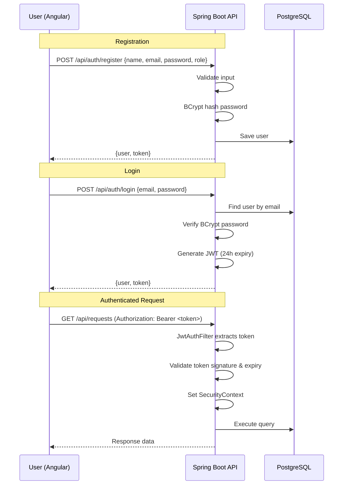

### 20.2 JWT Token Structure

```json
{
  "sub": "user@email.com",
  "userId": 1,
  "role": "PROVIDER",
  "organizationName": "City General Hospital",
  "iat": 1719408000,
  "exp": 1719494400
}
```

### 20.3 Security Configuration

| Aspect | Implementation |
|:-------|:---------------|
| Password Hashing | BCrypt (strength 10) |
| Token Algorithm | HMAC SHA-256 |
| Token Expiry | 24 hours |
| Public Endpoints | `/api/auth/**`, `/swagger-ui/**`, `/v3/api-docs/**` |
| CORS | Allow `http://localhost:4200` |
| CSRF | Disabled (stateless JWT) |
| Role Enforcement | `@PreAuthorize` on controller methods |

---

## 21. AI Integration Architecture

### 21.1 Architecture

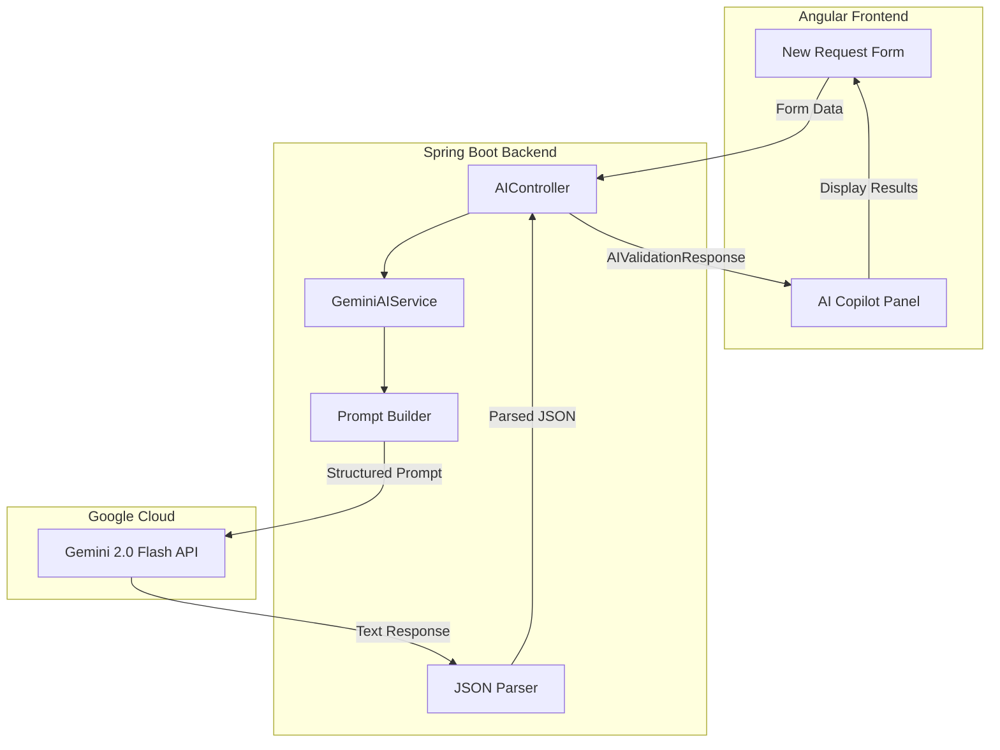

### 21.2 Gemini API Configuration

```properties
# application.properties
gemini.api.key=${GEMINI_API_KEY}
gemini.api.url=https://generativelanguage.googleapis.com/v1beta/models/gemini-2.0-flash:generateContent
gemini.api.temperature=0.3
gemini.api.max-tokens=2048
```

### 21.3 Rate Limiting
- Gemini free tier: ~15 requests per minute
- Frontend: Debounce validation button (3-second cooldown after click)
- Backend: In-memory rate limiter per user (max 10 calls per minute)

### 21.4 Error Handling for AI
| Scenario | Behavior |
|:---------|:---------|
| Gemini API timeout | Return partial validation (backend rules only) with warning |
| Invalid JSON response | Retry once, then return raw text as summary |
| Rate limit exceeded | Return 429 with "Please wait before validating again" |
| API key invalid | Return 503 with "AI service temporarily unavailable" |

---

## 22. File Upload Strategy (Cloudinary Integration)

### 22.1 Configuration

```properties
spring.servlet.multipart.max-file-size=5MB
spring.servlet.multipart.max-request-size=25MB

# Cloudinary credentials mapped from .env
cloudinary.cloud-name=${CLOUDINARY_CLOUD_NAME}
cloudinary.api-key=${CLOUDINARY_API_KEY}
cloudinary.api-secret=${CLOUDINARY_API_SECRET}
cloudinary.url=${CLOUDINARY_URL}
```

### 22.2 Storage Architecture
Rather than storing files locally, the system uploads files securely to Cloudinary using their REST API.
- Both PDF documents and image attachments are supported.
- Requests are signed with a secure SHA-1 signature constructed from the sorted API parameters and the API secret.
- The Cloudinary server returns a secure, permanent CDN URL (`secure_url`), which is stored in the `filePath` column of the `documents` table in PostgreSQL.

### 22.3 Implementation Details
| Aspect | Detail |
|:-------|:-------|
| Allowed Types | PDF, JPG, JPEG, PNG |
| Max File Size | 5 MB per file |
| Max Files/Request | 5 files |
| Storage | Cloudinary Cloud CDN |
| Authentication | Signed REST requests using API Key, Secret, and Timestamp signature |
| Retrieval | Streamed from Cloudinary via backend `UrlResource` (to prevent CORS restrictions) |
| Fallback | If Cloudinary is down, throw appropriate upload exception |

---

## 23. Validation Strategy

### 23.1 Three-Layer Validation

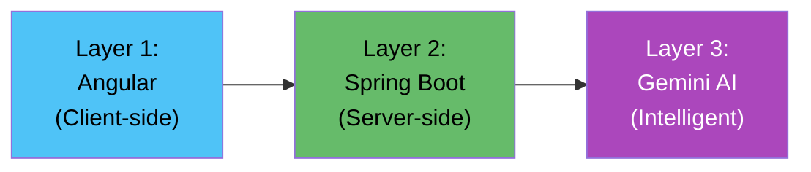

| Layer | Tool | What It Validates |
|:------|:-----|:------------------|
| **1. Client (Angular)** | Angular Reactive Forms + Validators | Required fields, format (email, phone), min/max length, date ranges |
| **2. Server (Spring)** | `@Valid` + JSR-380 annotations | All of Layer 1 + business rules (duplicate check, role verification, foreign key existence) |
| **3. AI (Gemini)** | GeminiAIService | Completeness, clinical consistency, cost reasonableness, document requirements, ICD-10/CPT validity |

### 23.2 Backend Validation Annotations

```java
public class AuthorizationRequestDTO {
    @NotBlank(message = "Patient first name is required")
    @Size(min = 2, max = 100)
    private String patientFirstName;

    @NotNull(message = "Date of birth is required")
    @Past(message = "Date of birth must be in the past")
    private LocalDate patientDob;

    @NotNull(message = "Estimated cost is required")
    @DecimalMin(value = "1.0", message = "Cost must be greater than 0")
    private BigDecimal estimatedCost;

    @Pattern(regexp = "^[A-Z][0-9]{2}(\\.[0-9]{1,4})?$", message = "Invalid ICD-10 format")
    private String primaryDiagnosisCode;

    @Pattern(regexp = "^[0-9]{5}$", message = "Invalid CPT code format")
    private String procedureCode;
}
```

---

## 24. Exception Handling Strategy

### 24.1 Global Exception Handler

```java
@RestControllerAdvice
public class GlobalExceptionHandler {

    @ExceptionHandler(ResourceNotFoundException.class)     // → 404
    @ExceptionHandler(BadRequestException.class)           // → 400
    @ExceptionHandler(UnauthorizedException.class)         // → 401
    @ExceptionHandler(AccessDeniedException.class)         // → 403
    @ExceptionHandler(MethodArgumentNotValidException.class) // → 400 (validation)
    @ExceptionHandler(FileUploadException.class)           // → 413/415
    @ExceptionHandler(Exception.class)                     // → 500 (fallback)
}
```

### 24.2 Standard Error Response

```json
{
  "success": false,
  "status": 400,
  "message": "Validation failed",
  "errors": [
    { "field": "patientFirstName", "message": "Patient first name is required" },
    { "field": "estimatedCost", "message": "Cost must be greater than 0" }
  ],
  "timestamp": "2026-06-26T14:30:00Z"
}
```

---

## 25. Logging Strategy

### 25.1 Framework
- **SLF4J** with **Logback** (Spring Boot default)

### 25.2 Log Levels by Package

| Package | Level | Rationale |
|:--------|:------|:----------|
| `com.carebridge.ai.controller` | INFO | Log all incoming requests |
| `com.carebridge.ai.service` | DEBUG | Business logic flow |
| `com.carebridge.ai.service.GeminiAIService` | INFO | AI calls and responses |
| `com.carebridge.ai.config` | INFO | Security events |
| `org.springframework.security` | WARN | Security issues only |
| `org.hibernate.SQL` | DEBUG (dev) / WARN (prod) | SQL debugging |

### 25.3 Log Format
```
[%date] [%level] [%thread] [%logger{36}] - %message%n
```

### 25.4 Key Logged Events
- User login/logout
- Authorization request created/updated
- AI validation requested/completed
- Status changes
- File uploads
- Errors and exceptions

---

## 26. Deployment Architecture

### 26.1 Local Development

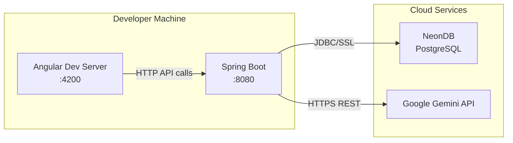

### 26.2 Data Flow Diagram

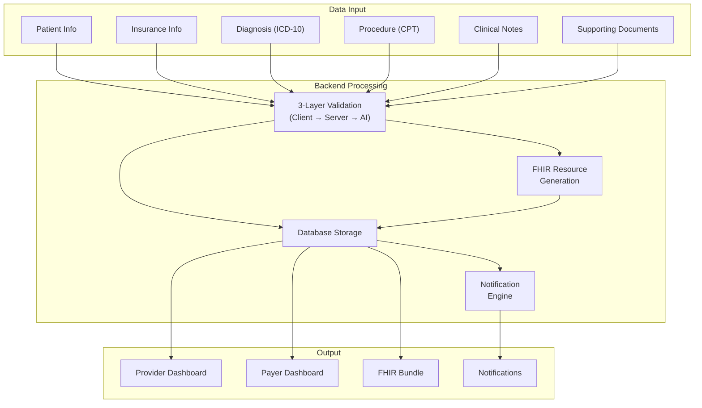

### 26.3 Environment Variables Required

```
# Database (NeonDB)
DATABASE_URL=jdbc:postgresql://<host>.neon.tech/<dbname>?sslmode=require
DB_USER=<username>
DB_PASSWORD=<password>

# AI
GEMINI_API_KEY=<your-api-key>

# JWT
JWT_SECRET=<64-char-random-string>

# File Upload
APP_UPLOAD_DIR=./uploads
```

### 26.4 Prerequisites for Running

| Tool | Version | Purpose |
|:-----|:--------|:--------|
| Java JDK | 21 | Backend runtime |
| Node.js | 20+ | Angular CLI and dev server |
| npm | 10+ | Frontend package manager |
| Maven | 3.9+ | Backend build tool |
| Angular CLI | 20.x | Angular project commands |
| Git | Latest | Version control |
| NeonDB Account | Free tier | PostgreSQL database |
| Google AI Studio Account | Free tier | Gemini API key |

---

## 27. Sequence Diagrams

### 27.1 Create & Submit Authorization Request

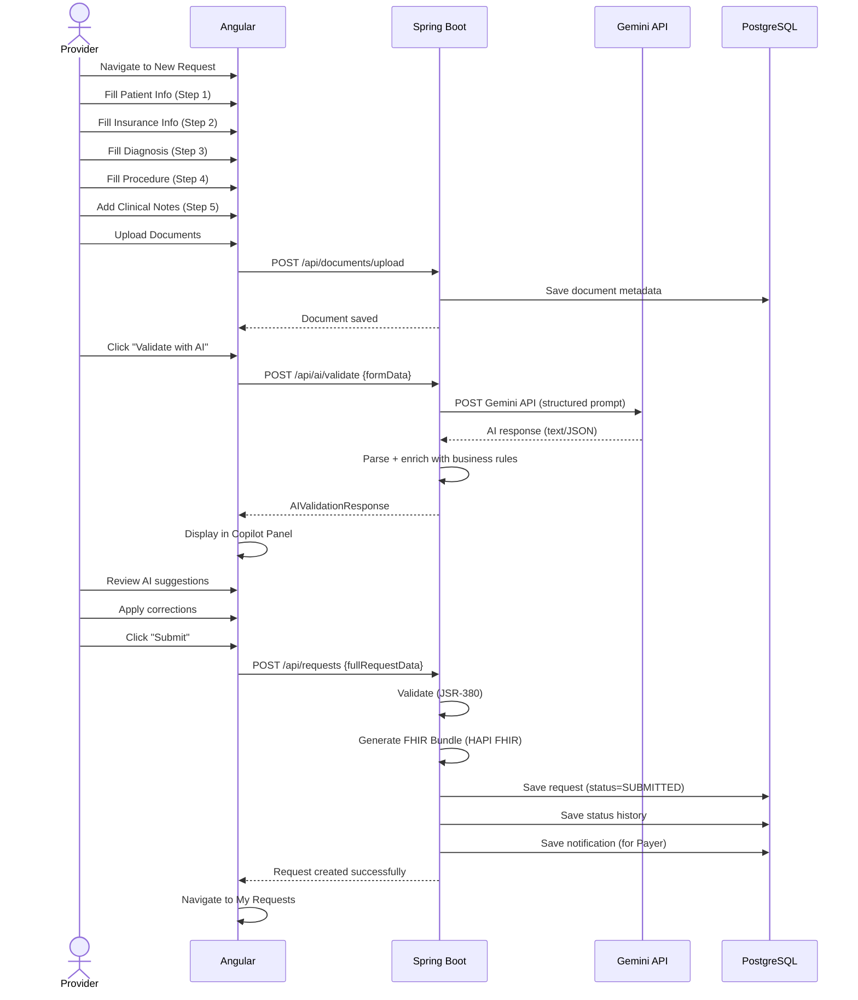

### 27.2 Payer Reviews and Takes Action

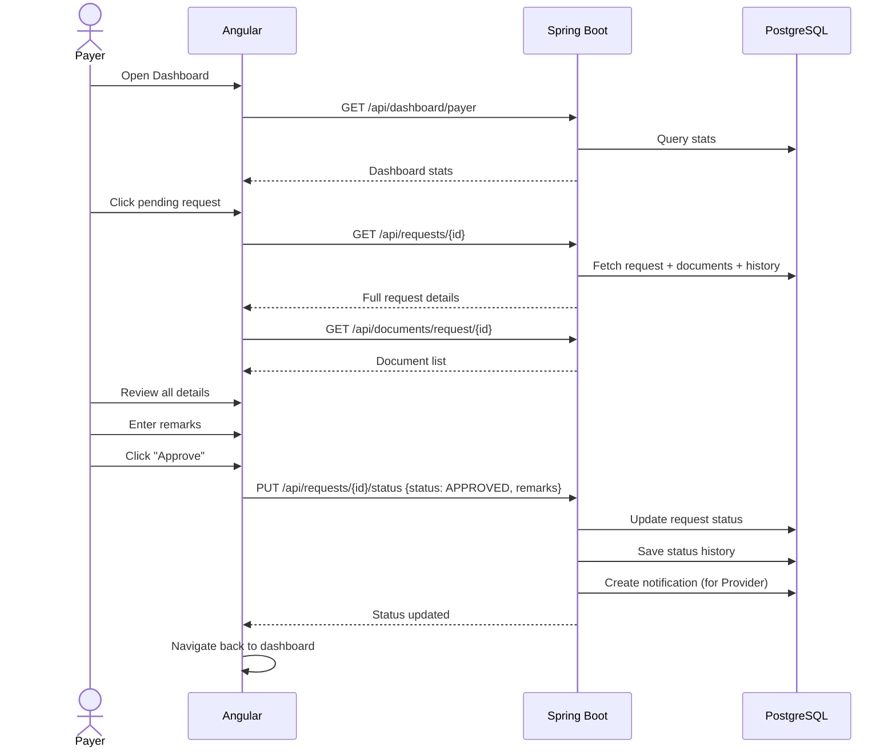

---

## 28. Activity Diagrams

### 28.1 Provider Authorization Workflow

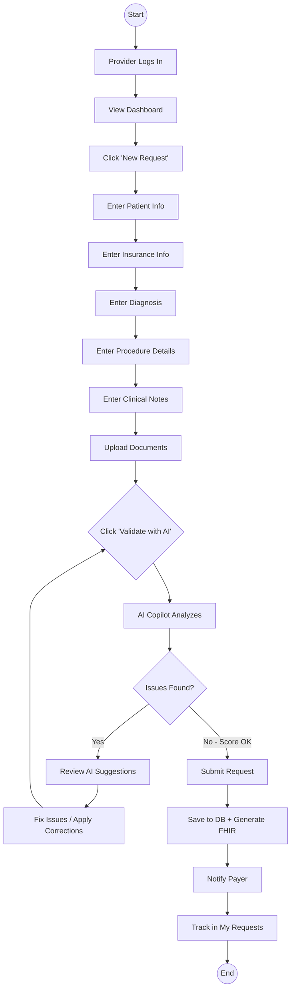

### 28.2 Payer Review Workflow

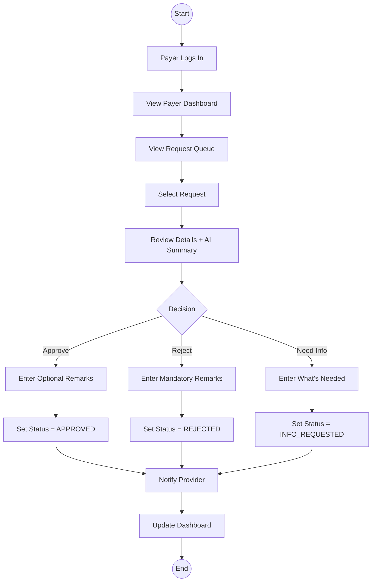

---

## 29. Component Diagrams

### 29.1 System Component Overview

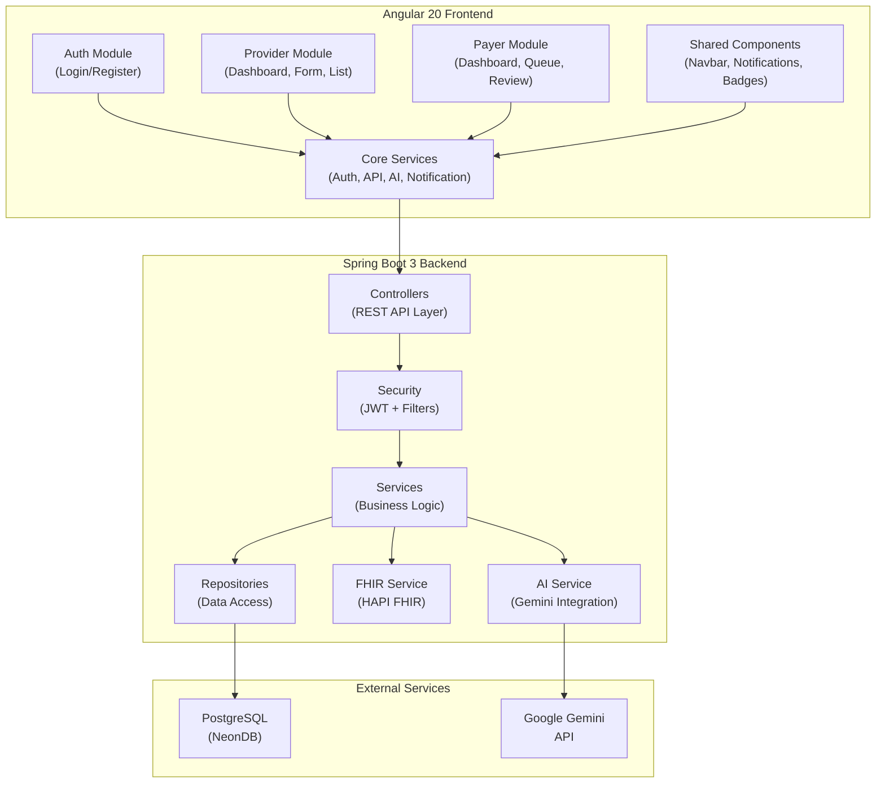

### 29.2 Backend Layer Dependencies

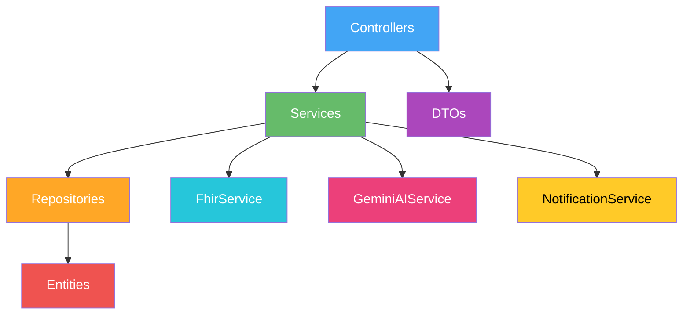

---

## 30. Folder Structure

### 30.1 Complete Project Root

```
Java-Provider-Payer-Communication-Avinash_chidurala/
├── backend/
│   ├── pom.xml
│   ├── src/
│   │   ├── main/
│   │   │   ├── java/com/carebridge/ai/
│   │   │   │   ├── CareBridgeAiApplication.java
│   │   │   │   ├── config/
│   │   │   │   ├── controller/
│   │   │   │   ├── dto/request/
│   │   │   │   ├── dto/response/
│   │   │   │   ├── entity/
│   │   │   │   ├── enums/
│   │   │   │   ├── exception/
│   │   │   │   ├── repository/
│   │   │   │   ├── service/
│   │   │   │   └── util/
│   │   │   └── resources/
│   │   │       ├── application.properties
│   │   │       └── application-dev.properties
│   │   └── test/java/com/carebridge/ai/
│   │       └── ...
│   └── uploads/                                    # Document storage
│
├── frontend/
│   ├── angular.json
│   ├── package.json
│   ├── tsconfig.json
│   ├── src/
│   │   ├── app/
│   │   │   ├── core/
│   │   │   ├── shared/
│   │   │   ├── features/
│   │   │   ├── app.component.*
│   │   │   ├── app.config.ts
│   │   │   └── app.routes.ts
│   │   ├── assets/
│   │   ├── environments/
│   │   ├── index.html
│   │   ├── main.ts
│   │   └── styles.css
│   └── ...
│
├── .gitignore
└── README.md
```

---

## 31. Development Phases

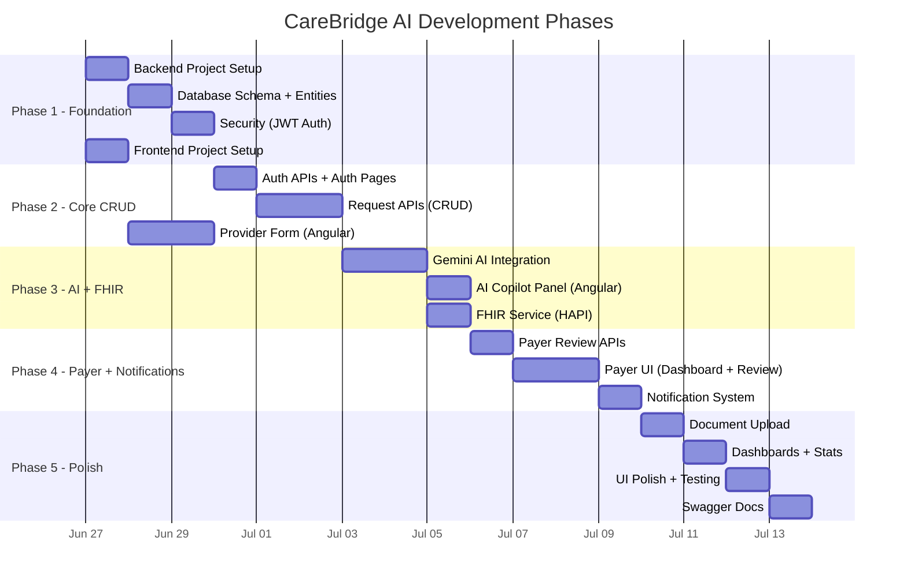

---

## 32. Sprint-Wise Implementation Plan

### Sprint 1 — Foundation & Auth (Days 1-2)

| # | Task | Type | Priority |
|:--|:-----|:-----|:---------|
| 1.1 | Create Spring Boot project with Maven | Backend | P0 |
| 1.2 | Configure pom.xml with all dependencies (incl. spring-boot-starter-mail) | Backend | P0 |
| 1.3 | Configure application.properties (NeonDB, Gemini, JWT, Gmail SMTP) | Backend | P0 |
| 1.4 | Create all Entity classes (User, AuthorizationRequest, Document, Notification, StatusHistory, EmailVerification, PasswordResetToken) | Backend | P0 |
| 1.5 | Create all Enum classes | Backend | P0 |
| 1.6 | Create all Repository interfaces | Backend | P0 |
| 1.7 | Implement JwtUtil + JwtAuthFilter + SecurityConfig | Backend | P0 |
| 1.8 | Implement EmailService (Gmail SMTP: send OTP, reset link, notification emails) | Backend | P0 |
| 1.9 | Implement AuthService + AuthController (register, login, OTP verify, forgot/reset password) | Backend | P0 |
| 1.10 | Implement GlobalExceptionHandler | Backend | P0 |
| 1.11 | Create Angular project with Angular Material | Frontend | P0 |
| 1.12 | Set up core services structure + models | Frontend | P0 |
| 1.13 | Implement AuthService + JWT interceptor | Frontend | P0 |
| 1.14 | Build Login page | Frontend | P0 |
| 1.15 | Build Register page with OTP verification step | Frontend | P0 |
| 1.16 | Build Forgot Password / Reset Password pages | Frontend | P0 |
| 1.17 | Set up routing with guards | Frontend | P0 |
| 1.18 | Build Navbar with role-based navigation | Frontend | P0 |

### Sprint 2 — Provider Module (Days 3-5)

| # | Task | Type | Priority |
|:--|:-----|:-----|:---------|
| 2.1 | Create all DTO classes (Request + Response) | Backend | P0 |
| 2.2 | Implement AuthorizationRequestService | Backend | P0 |
| 2.3 | Implement AuthorizationRequestController (CRUD) | Backend | P0 |
| 2.4 | Implement DocumentService + DocumentController | Backend | P0 |
| 2.5 | Implement DashboardService + DashboardController | Backend | P0 |
| 2.6 | Implement PayerListController | Backend | P0 |
| 2.7 | Build New Request form (multi-step with Angular Material Stepper) | Frontend | P0 |
| 2.8 | Build Provider Dashboard | Frontend | P0 |
| 2.9 | Build My Requests list with filters | Frontend | P0 |
| 2.10 | Build Request Detail view with timeline | Frontend | P0 |
| 2.11 | Implement file upload component | Frontend | P0 |

### Sprint 3 — AI Copilot + FHIR (Days 6-7)

| # | Task | Type | Priority |
|:--|:-----|:-----|:---------|
| 3.1 | Implement GeminiAIService (prompt engineering, HTTP call, JSON parse) | Backend | P0 |
| 3.2 | Implement AIController | Backend | P0 |
| 3.3 | Implement FhirService (Patient, Organization, Coverage, Claim, DocumentReference, Bundle) | Backend | P1 |
| 3.4 | Add FHIR endpoint to RequestController | Backend | P1 |
| 3.5 | Build AI Copilot Panel component | Frontend | P0 |
| 3.6 | Integrate AI panel with request form | Frontend | P0 |
| 3.7 | Build FHIR JSON viewer (modal/dialog) | Frontend | P1 |

### Sprint 4 — Payer Module + Notifications (Days 8-10)

| # | Task | Type | Priority |
|:--|:-----|:-----|:---------|
| 4.1 | Implement status update logic with history tracking | Backend | P0 |
| 4.2 | Implement NotificationService + NotificationController | Backend | P0 |
| 4.3 | Implement resubmission logic | Backend | P1 |
| 4.4 | Build Payer Dashboard | Frontend | P0 |
| 4.5 | Build Request Queue with filters | Frontend | P0 |
| 4.6 | Build Request Review page with action panel | Frontend | P0 |
| 4.7 | Build Notification Bell + Dropdown | Frontend | P0 |
| 4.8 | Implement notification polling service | Frontend | P0 |
| 4.9 | Implement resubmit UI flow | Frontend | P1 |

### Sprint 5 — Polish, Seed Data & Verification (Days 11-12)

| # | Task | Type | Priority |
|:--|:-----|:-----|:---------|
| 5.1 | Add Swagger/OpenAPI annotations | Backend | P1 |
| 5.2 | Implement DataSeederService (seed test data) | Backend | P0 |
| 5.3 | UI theme polish (colors, animations, responsiveness) | Frontend | P1 |
| 5.4 | Add loading states and error handling throughout | Frontend | P1 |
| 5.5 | End-to-end testing (full workflow incl. email) | Testing | P0 |
| 5.6 | Fix bugs and edge cases | Both | P0 |
| 5.7 | Write README.md (incl. Gmail SMTP setup instructions) | Docs | P1 |

---

## 32.5. Seed Data for Testing

### Pre-loaded Test Data

The system shall include a `DataSeederService` (`@Component` with `CommandLineRunner`) that populates the database on first startup with the following test data:

#### Seed Users (Pre-registered, email verified, passwords = `Test@1234`)

| # | Name | Email | Role | Organization | Provider Type |
|:--|:-----|:------|:-----|:-------------|:--------------|
| 1 | Dr. Rajesh Kumar | `provider1@carebridge.demo` | PROVIDER | City General Hospital | General Hospital |
| 2 | Dr. Priya Sharma | `provider2@carebridge.demo` | PROVIDER | Smile Dental Care | Dental Clinic |
| 3 | Dr. Arun Patel | `provider3@carebridge.demo` | PROVIDER | Heart Care Institute | Cardiology Hospital |
| 4 | Star Health Admin | `payer1@carebridge.demo` | PAYER | Star Health Insurance | — |
| 5 | HDFC ERGO Admin | `payer2@carebridge.demo` | PAYER | HDFC ERGO Health | — |
| 6 | ICICI Lombard Admin | `payer3@carebridge.demo` | PAYER | ICICI Lombard | — |

#### Seed Authorization Requests (Various Statuses)

| # | Patient | Diagnosis | Procedure | Cost (₹) | Provider | Payer | Status |
|:--|:--------|:----------|:----------|:---------|:---------|:------|:-------|
| 1 | Amit Verma | M17.11 - Osteoarthritis, right knee | 27447 - Total knee arthroplasty | 3,50,000 | City General | Star Health | APPROVED |
| 2 | Sunita Devi | K80.20 - Gallstone | 47562 - Laparoscopic cholecystectomy | 1,20,000 | City General | HDFC ERGO | SUBMITTED |
| 3 | Ravi Shankar | I25.10 - Coronary artery disease | 33533 - CABG surgery | 5,00,000 | Heart Care | Star Health | UNDER_REVIEW |
| 4 | Meera Reddy | K21.0 - GERD | 43239 - Upper GI endoscopy | 35,000 | City General | ICICI Lombard | REJECTED |
| 5 | Vijay Kumar | S72.001A - Femur fracture | 27245 - Femur fracture fixation | 2,80,000 | City General | Star Health | INFO_REQUESTED |

#### Seed Notifications

Pre-populated notifications for each seed request matching their status (e.g., approved request has submission + approval notifications).

#### Seed Status History

Complete status history for each seed request showing the progression of status changes.

> [!NOTE]
> Seed data is only loaded when the database is empty (no users exist). The `DataSeederService` checks `userRepository.count() == 0` before seeding.

---

## 33. Testing Strategy

### 33.1 Testing Layers

| Layer | Tool | Coverage |
|:------|:-----|:---------|
| **Backend Unit Tests** | JUnit 5 + Mockito | Service layer methods, validation logic |
| **Backend Integration Tests** | Spring Boot Test + H2 | Controller endpoints, full request flow |
| **Frontend Unit Tests** | Jasmine + Karma (Angular default) | Service methods, component logic |
| **Frontend E2E Tests** | Manual / Browser verification | Full user workflows |
| **API Testing** | Swagger UI + Postman | All REST endpoints |

### 33.2 Key Test Scenarios

| # | Scenario | Type |
|:--|:---------|:-----|
| T01 | Register Provider, Login, Get JWT | Integration |
| T02 | Create request with valid data | Integration |
| T03 | Create request with missing fields → 400 | Integration |
| T04 | AI validation with complete data → quality score | Integration |
| T05 | AI validation with incomplete data → warnings | Integration |
| T06 | Submit request → FHIR bundle generated | Integration |
| T07 | Payer approves → notification created | Integration |
| T08 | Payer rejects without remarks → 400 | Integration |
| T09 | Provider resubmits rejected request → status reset | Integration |
| T10 | Upload file > 5MB → 413 | Integration |
| T11 | Access payer endpoint as provider → 403 | Security |
| T12 | Access with expired JWT → 401 | Security |

---

## 34. Future Enhancements

| # | Enhancement | Value | Complexity |
|:--|:-----------|:------|:-----------|
| FE01 | WebSocket real-time notifications | Instant updates (replace polling) | Medium |
| FE02 | Admin role for platform management | Multi-tenant readiness | Medium |
| FE03 | PDF report generation for approved requests | Business documentation | Low |
| FE04 | Audit log with complete change history | Compliance (HIPAA prep) | Medium |
| FE05 | ICD-10/CPT code auto-suggest (lookup API) | Faster data entry | Medium |
| FE06 | Multi-language support (i18n) | Broader reach | Medium |
| FE07 | Dark mode toggle | User preference | Low |
| FE09 | Request analytics (charts, trends) | Business intelligence | Medium |
| FE10 | Bulk request import (CSV/Excel) | Operational efficiency | High |
| FE11 | AI-powered document OCR (extract info from uploaded docs) | Automation | High |
| FE12 | Request SLA tracking (response time targets) | Quality metrics | Medium |

---

## 35. Demo Scenario

### 35.1 Demo Script (10-minute walkthrough)

**Act 1 — Registration (1 min)**
1. Register as **Provider**: "City General Hospital" (General Hospital type)
2. Register as **Payer**: "Star Health Insurance"

**Act 2 — Provider Creates Request (4 min)**
1. Login as Provider
2. View empty dashboard
3. Click "New Authorization Request"
4. Fill Patient Info: Rajesh Kumar, Male, DOB 1975-03-15
5. Fill Insurance: Star Health, Policy #SH-2026-78451
6. Fill Diagnosis: ICD-10 M17.11 (Primary osteoarthritis, right knee)
7. Fill Procedure: CPT 27447 (Total knee arthroplasty), ₹3,50,000
8. Enter Clinical Notes: "Patient presents with severe right knee pain..."
9. Upload X-ray report (sample PDF)
10. **Click "Validate with AI"** — Show AI Copilot results
    - Quality Score: 88/100
    - Approval Probability: HIGH
    - Suggestions: "Add secondary diagnosis for comorbidity"
11. Apply AI suggestion
12. Re-validate → Score: 94/100
13. Submit request ✅

**Act 3 — Payer Reviews (3 min)**
1. Login as Payer (Star Health)
2. See notification badge (1 new request)
3. View Payer Dashboard — 1 Pending
4. Open request, review all details + AI summary
5. View uploaded X-ray document
6. **Approve** the request with remarks: "Authorization granted. Valid for 30 days."

**Act 4 — Provider Gets Notified (2 min)**
1. Login as Provider
2. See notification: "Request #REQ-1001 APPROVED by Star Health"
3. View updated dashboard — 1 Approved
4. Open request detail — see full timeline
5. View FHIR Bundle JSON

### 35.2 Demo Data Requirements
- 2 pre-registered users (1 Provider, 1 Payer)
- 1 fully completed authorization request
- Sample supporting document (PDF)

---

## 36. Risks & Mitigation

| # | Risk | Impact | Probability | Mitigation |
|:--|:-----|:-------|:------------|:-----------|
| R1 | Gemini API rate limit exceeded | AI validation fails | Medium | Implement backend rate limiting, cache recent responses, graceful fallback to rule-based validation |
| R2 | NeonDB free tier cold start latency | Slow first request | High | Add loading spinner, document the cold start behavior |
| R3 | NeonDB storage limit (0.5 GB) | Cannot store more data | Low (demo) | Monitor usage, use text compression for FHIR JSON |
| R4 | Gemini returns non-JSON response | Parse failure | Medium | Retry once, fallback to raw text display |
| R5 | File upload security (malicious files) | Security vulnerability | Low | Validate MIME types server-side, scan file headers |
| R6 | JWT secret leaked | Authentication compromised | Low | Use environment variables, never commit to Git |
| R7 | Angular Material version incompatibility | Build failures | Low | Pin dependency versions in package.json |
| R8 | CORS misconfiguration | Frontend can't reach backend | Medium | Test early, document allowed origins |
| R9 | Large FHIR bundles slow down UI | Poor UX | Low | Lazy-load FHIR view, use virtual scrolling |
| R10 | Concurrent status updates | Data inconsistency | Low | Use optimistic locking (`@Version` in JPA) |

---

## 37. Enterprise-Grade Improvements

These additions strengthen the project while staying focused on the authorization workflow:

### 37.1 Optimistic Locking
Add `@Version` column to `AuthorizationRequest` to prevent concurrent update conflicts when multiple payer users review simultaneously.

### 37.2 Request Audit Trail
The `status_history` table provides a complete audit trail of every status change — who changed it, when, and why. This is critical for healthcare compliance.

### 37.3 Idempotent API Design
Use request IDs or unique constraints to prevent duplicate submission on network retry (double-click protection).

### 37.4 DTO Pattern (Strict)
Never expose JPA entities directly through REST APIs. All data passes through DTOs, protecting internal schema and allowing API evolution independent of database changes.

### 37.5 Structured Logging for Debugging
Log correlation IDs (request ID, user ID) in every log entry to enable tracing a single request across all service calls.

### 37.6 Health Check Endpoint
```
GET /actuator/health → { "status": "UP", "db": "UP", "gemini": "AVAILABLE" }
```

### 37.7 API Versioning Readiness
All endpoints under `/api/` — ready to prefix with `/api/v1/` if a v2 is ever needed.

### 37.8 Configuration Externalization
All sensitive configs (DB, JWT, Gemini key) externalized to environment variables. No hardcoded secrets.

### 37.9 Request ID Format
Generate human-readable request IDs (e.g., `REQ-1001`, `REQ-1002`) instead of raw database IDs. Displayed in UI and notifications.

### 37.10 Pagination & Sorting
All list endpoints support pagination (`page`, `size`) and sorting (`sort`) parameters:
```
GET /api/requests/provider?page=0&size=10&sort=createdAt,desc
```

### 37.11 Input Sanitization
All user inputs sanitized to prevent XSS and SQL injection. HTML tags stripped from text inputs. File names sanitized before storage.

### 37.12 Response Envelope Pattern
All API responses wrapped in a consistent envelope:
```json
{
  "success": true,
  "message": "Request created successfully",
  "data": { ... },
  "timestamp": "2026-06-26T14:30:00Z"
}
```

### 37.13 Upstash Redis Caching & Rate-Limiting
To ensure high availability and stay strictly within the free tier compute constraints:
- **Payer Caching**: The list of registered payers returned by `GET /api/requests/payers` is cached in Redis (with a 1-hour time-to-live) using Spring's REST client.
- **Endpoint Protection**: Rate limits login, registration, OTP generation, and password resets based on user email or IP. Allows a maximum of 3 requests per 60 seconds. Returns HTTP 429 if exceeded.

### 37.14 Startup API Credentials Health Check
Integrates a startup health-checking diagnostics runner (`ApiCredentialsChecker`) that tests:
- Database connectivity to NeonDB.
- Gemini API key authentication (detecting status 429 quota exhaustion vs 403 authorization failures).
- Upstash Redis REST connectivity.
- Cloudinary secure upload operations.
Logs a formatted status check report during bootstrap, making it easy to identify and locate configuration issues.

---

## Appendix A — Checklist of All 37 Points

| # | Section | Status |
|:--|:--------|:------:|
| 1 | Business Analysis & Assumptions | ✅ Complete |
| 2 | End-to-End Authorization Workflow | ✅ Complete |
| 3 | Complete Feature List | ✅ Complete |
| 4 | Functional Requirements | ✅ Complete |
| 5 | Non-Functional Requirements | ✅ Complete |
| 6 | User Roles & Permissions | ✅ Complete |
| 7 | Provider Module Breakdown | ✅ Complete |
| 8 | Payer Module Breakdown | ✅ Complete |
| 9 | AI Copilot Features | ✅ Complete (with real-time validation) |
| 10 | Notification Workflow | ✅ Complete |
| 11 | Status Lifecycle | ✅ Complete |
| 12 | Dashboard Requirements | ✅ Complete |
| 13 | Screen-by-Screen UI Plan | ✅ Complete (with wireframes) |
| 14 | Database Design | ✅ Complete (5 tables) |
| 15 | Entity Relationship Diagram | ✅ Complete (Mermaid ER) |
| 16 | FHIR Resource Mapping | ✅ Complete (7 resources + ClaimResponse) |
| 17 | REST API Specification | ✅ Complete (22+ endpoints) |
| 18 | Backend Package Structure | ✅ Complete |
| 19 | Angular Project Structure | ✅ Complete |
| 20 | Security Architecture | ✅ Complete (JWT flow + config) |
| 21 | AI Integration Architecture | ✅ Complete (with prompt engineering) |
| 22 | File Upload Strategy | ✅ Complete |
| 23 | Validation Strategy | ✅ Complete (3-layer) |
| 24 | Exception Handling Strategy | ✅ Complete |
| 25 | Logging Strategy | ✅ Complete |
| 26 | Deployment Architecture | ✅ Complete (with data flow) |
| 27 | Sequence Diagrams | ✅ Complete (2 diagrams) |
| 28 | Activity Diagrams | ✅ Complete (2 diagrams) |
| 29 | Component Diagrams | ✅ Complete (2 diagrams) |
| 30 | Folder Structure | ✅ Complete |
| 31 | Development Phases | ✅ Complete (Gantt chart) |
| 32 | Sprint-Wise Implementation Plan | ✅ Complete (5 sprints) |
| 33 | Testing Strategy | ✅ Complete |
| 34 | Future Enhancements | ✅ Complete (12 items) |
| 35 | Demo Scenario | ✅ Complete (10-min script) |
| 36 | Risks & Mitigation | ✅ Complete (10 risks) |
| 37 | Enterprise-Grade Improvements | ✅ Complete (12 improvements) |

---

> [!IMPORTANT]
> **Ready for Review.** This document covers all 37 sections with every requirement from the original prompt included. Key additions:
> - Complete provider types list (16 types) and payer examples (6 companies)
> - Full technology stack table (Java 21, Angular 20, HAPI FHIR, etc.)
> - Detailed provider and payer responsibilities
> - Real-time AI validation during form entry (key differentiator)
> - ICD-10 and CPT code validation by AI
> - ClaimResponse FHIR generation on payer decision
> - Detailed AI prompt engineering with 14-point validation
> - Data flow diagram
> - Prerequisites and environment setup
>
> Please review and approve before I begin code generation. Any section can be adjusted based on your feedback.
